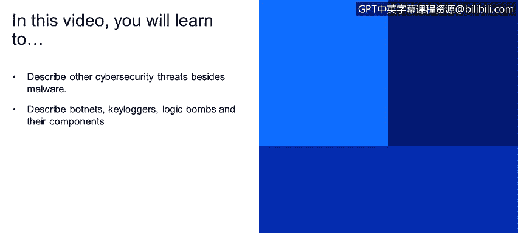
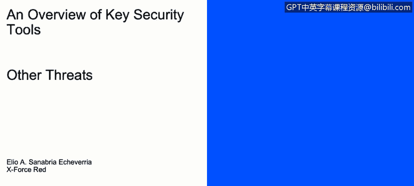
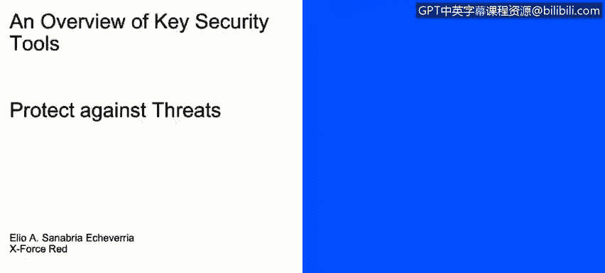

# IBM网络安全分析师专业证书课程1：《网络安全工具与网络攻击简介课程（IBM）》introduction-cybersecurity-cyber-attacks - P30：30_威胁示例.zh - GPT中英字幕课程资源 - BV1c84y1Z7Dp

Yes。In this video， you will learn to describe other cybersecurity threats besides malware。

Describe botnets， key loggers， logic bombs， and their components。

Now we will speak regarding other threats out。

So button buttons are a set of compromise host that enables attackers to exploit those computer resources to mount attacks。

This kind of tactic is used by blackhead hackers in order to run operations such as sending spam during the id service attacks。

 phishing， spyware， mine personal information， or cryptocur。

The computer part of this buttonnet are also known as zombies or drones that are away command from a buttmaster or a bot herderder。

Other mod attacks， we have key loggers。 Keylogger is any hardware software。

That records every keystroke made by a user。We have logic bombs。

 Its code a doorments on a target until it's triggered by specific events， such as a data and time。

 When the condition is met， it de donates to perform whatever it was programmed to do。

 usually raising data or corrupting systems。Then， we have。As or advanced versus Ts。

Its main goal is to get access and monitor the network to steal information while staying undetected for a long period of time。

 usually it targets organizations such as military， government。

 finance or companies that have high value information。

 some known groups that are out there are fancy Russia。

 Lazarus group of North Korea or periiscope group of China。

