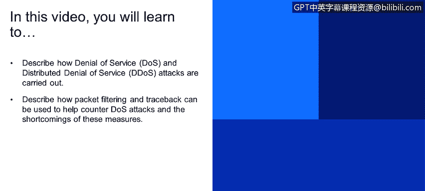

# IBM网络安全分析师专业证书课程1：《网络安全工具与网络攻击简介课程（IBM）》introduction-cybersecurity-cyber-attacks - P35：35_安全威胁拒绝服务.zh - GPT中英字幕课程资源 - BV1c84y1Z7Dp

Yes。In this video， you will learn to describe how denial of service and distributed denial of service attacks are carried out。

Describe how packet filtering and traceback can be used to help counter denial of service attacks and the shortcomings of these measures。

One of the major attack scenarios in the cybersecurity world is that of the denial of service or DOOS。

So this has to do with a flood of maliciously generated packages that basically overwhelmed swamped the receiver and spend so much time。

Handling the incoming packets that they have no time for other computationally intensive activities。

There's single。Deialable service attacks is also distributed， which is DDOS。

 which talks about multiple sources swamping a receiver the distributed attacks are resistanted to single IP blocking。

RightAnd we see that activity demonstrated in the diagram here at the bottom of page 18。

So how to how to what's a countermeasure fitting out right。

 flooding packets before reaching the host， having a filter。

 But the problem there is that you're going to be filtering out solid and legitimate packets along with the bad。

 You could talk about a the ability to trace back to the source of the floods。

 But this only applies against innocent and compromised machines。

 So the idea about dynamic filtering being able to adjust as the。Traffic patterns are。

Realize plus the ability to intelligently filter out packets will help reduce the effect of denial of service。

