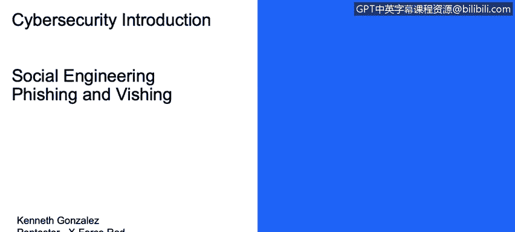
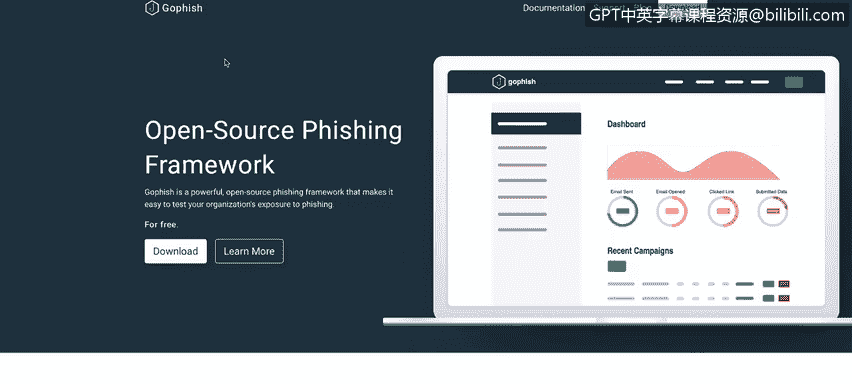
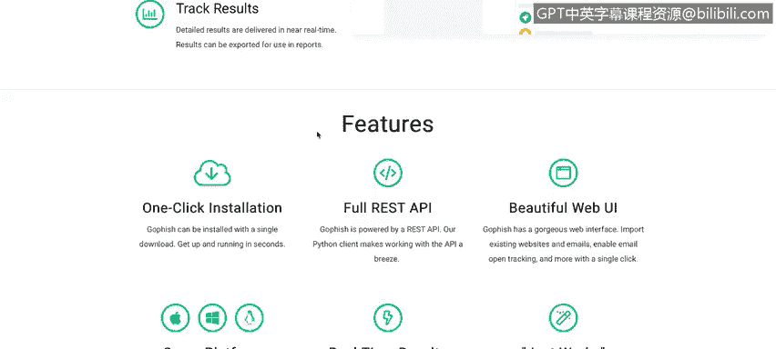
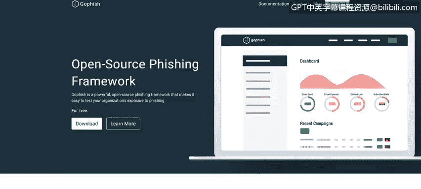
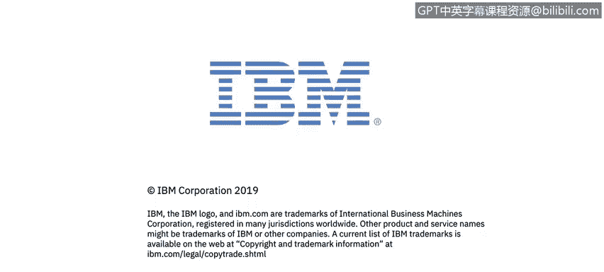

# IBM网络安全分析师专业证书课程1：《网络安全工具与网络攻击简介课程（IBM）》introduction-cybersecurity-cyber-attacks - P39：39_社会工程网络钓鱼和语音钓鱼.zh - GPT中英字幕课程资源 - BV1c84y1Z7Dp

In this video， you will learn to describe phish and fishing campaigns how they work and how they differ Something else that you could do is start like something that we call a phishing campaign and there is a lot of good tools。

 one that I normally uses goldfish Gofish is an open source ph platform that will give you a lot of tools。

 a lot of information to try to understand if your cyberse training program inside your company inside your network is something that it's adding value to the knowledge of the users。

 So a quick example here is as soon as you start using the gofishing framework you could start creating a campaign with a fake email。

 fake URL and a fake HTML and send that email to a set of users and。

Understand if the user click the email if they open the email or if they add credentials into the fake URL for you to understand if all the security awareness programs that you have on your company are。

Good enough or sufficient for the user to understand what they shouldn't do if they receive a phish email。

So another example of social engineering is this YouTube video。 It's something that we call Piing。

 In this video， you will see a Carol talking with an agent representative from from a telephone company。

 and she will try to trick the the I guide support guide from。

Tele telephone company to add her as one of the contacts on her husband telephone plan。

 but there is a couple of tweaks here， there is a couple of things obviously this is an a quick example of of a visioning attack phishing attack is something like phing so in vision you send a fake email with fake information in order to try for a user to give you something in a vision you are doing the same。

 but you are not using email you are using your voice so that's why we call it visioning so I recommend you to watch this video pay close attention of the techniques that she is using in order to treat the user。

 the agent of the telephoneic company and basically try to understand all the different aspects of the social and engineering process。

You will need to have a certain skills in order to perform these kind of attacks， because obviously。

 you need to have confidence。 You need to have skills that will help you a lot when you are talking with somebody and try to manipulate somebody in order for you to get information。

