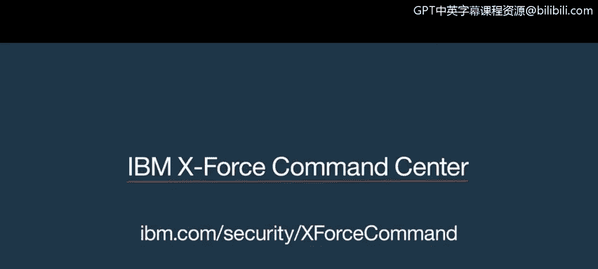

# IBM网络安全分析师专业证书课程1：《网络安全工具与网络攻击简介课程（IBM）》introduction-cybersecurity-cyber-attacks - P42：42_X力量命令中心简介.zh - GPT中英字幕课程资源 - BV1c84y1Z7Dp

Yes， sir。 I completely understand， sir。Thank you。Just go for the FBI， think bit a situation。Hey。

 guys， are you seeing this on the firewall？All right， team。

 we have a threat that's just been validated。Can you throw up a classy block on that firewall we want to test something？

Yep。Yeah， I see it too。How many machines are beening？Hold on， we're isolating the IPP。

🎼Where's this even coming from。Well， as we said， Amy。

 they look to be the victim of a major date of breach from a very sophisticated cybercrime group。

It's hard to say if the hackers are still in the network as of right now。

 we really don't know where the attack is coming from or who's behind it。

So we talk about the impact on the financial sector and Wall Street， but all right everybody。

 let's go， let's go， it is out there。We need to make this a permanent block， so let's go， let's go。

I need some answers。James， come on。Come on， come on， come on， we got 60 seconds ready to go guys。

 it doesn't get much worse and for what we can say it and it looks like they actually may change。🎼ま。

Three， two， the ramifications。

🎼中。We're dealing with a lot of uncertainty now what I can tell you is that we've got a fantastic team that's working around the clock to resolve any issues that arise and as soon as any information comes up。

 I'll be glad to give that to you in real time。

