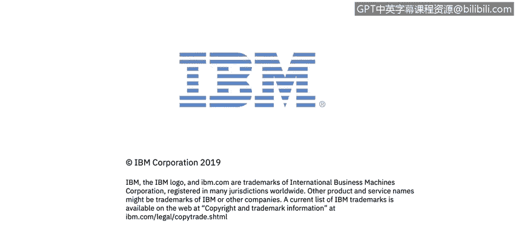

# IBM网络安全分析师专业证书课程1：《网络安全工具与网络攻击简介课程（IBM）》introduction-cybersecurity-cyber-attacks - P44：44_欢迎来到关键安全概念概述.zh - GPT中英字幕课程资源 - BV1c84y1Z7Dp

In module3， Kenneth， John and Dom will take you through some key security concepts。

 including the CIA Triad， Access Control， incidentci response， and the security frameworks。

You will be introduced to NISistT， the US National Institute for Standards and Technology。

 There is a link to the NISist cybersecurity framework for additional reading。

 We will go into more detail on NIST and the frameworks in a future course。 Now。

 let's take a look at those concepts。

