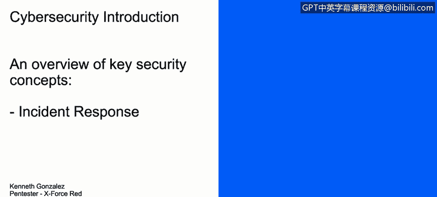
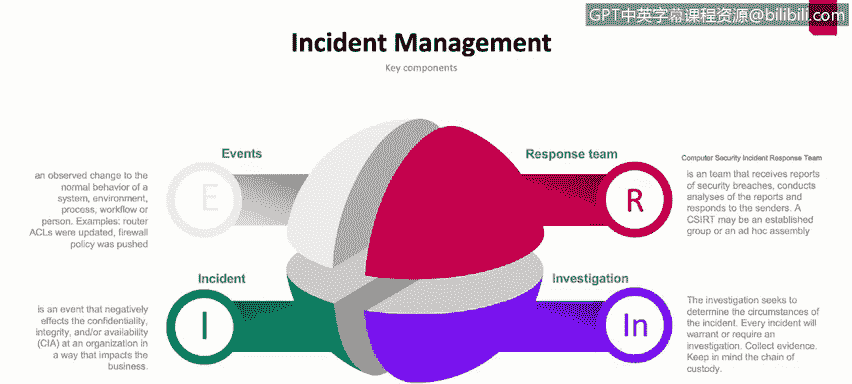

# IBM网络安全分析师专业证书课程1：《网络安全工具与网络攻击简介课程（IBM）》introduction-cybersecurity-cyber-attacks - P50：50_安全事件响应.zh - GPT中英字幕课程资源 - BV1c84y1Z7Dp

Yes。In this video， you will learn to。Describe the management process of incident response。

 how it is implemented and why it is important to an overall security schema。

In this video， we are going to talk about incident response。

Incident response is a process， is a management process or a management process that most of today's companies are dealing with。

 it's actually something really， really important because it will understand that it will generate information about incidents about events or errors or even attacks that computer networks or networks at all are suffering so。

This means that as soon as somebody or something happened in our network that is not normal that is something that is not expected by the C admin or by anyone in the company。

 it will generate an incident So how could we take that incident。

 How could we take that event and try to understand what happened。

 how could we prevent any new incident in the future or how could we restore the service or the data or the computer or the network as soon as possible。

 all of those concepts are incident management， Obviously there is a lot of things and we are going to talk about those things now。

 So basically there is some key components on the incident management management process First of all。

 it's important to understand what is an event an event obviously could be something something that is not。

Normal， something that is not part of the normal behavior of the network or normal behavior of the company。

 but that actually is an incident we're going to talk about the incident in a couple of minutes。

 but right now an event could be something that changed the normal behavior of the system could be something that could be program or not is something that changed what is the normal process on the company on the network on the computer or it will be something that for example。

 something like a access control list update or a farwall policy was push or was update by someone in the company or a logging event into the server could be something normal could be something expected or not。

 but normally and the common criteria here is is something that changed the normal behavior or change。

The normal process in the company in the system in the computer now we have the incident。

 the incident is the negative part of the event so for example。

 if somebody goes log in to the server and update the ACL that's an event that event could be generated or could be something that is expected because there is a ticket that says that hey。

 the system administrator needs to go to the server and update the ACL in order to grant access to some part of the network or in order to grant access to the BPN user or something like that。

 but what happened if somebody detects that someone goes to the server change the ACL and disable or deny all the access to the servers in the company from the external network so nobody from internet。

 nobody from the external network of the company can access the servers。That is an incident。

 So it's something that will negatively impact the confidentiality。

 the integrity and the availability of the security in the organization。 Normally。

 those incidents impacts the business in so different ways。 So， for example。

 could impact the normal service of the of the company could impact。

The legal part of the company could impact the operational part of the company。

 the financial part of the company。 Okay， now to deal with the incident， we have the response team。

 The response team commonly known as the scisrt is the team that will， first of all。

In some occasions， identify the bridge， identify the incident will deal with process to。

Resolve the incident and resolve the issue that we are having right now， so for example。

 if somebody goes to the server， disable and firewall policyi and nobody from the external network can access the internal network。

 the response team will try to fix that firewall policyi and try to restore the access to the internal network of the company。

Now one important part of the response team is the investigation process。

 they need to understand what happened， they need to collect evidence。

 they need to maintain the chain of custody of that process of that event of that incident in order to understand why this incident happened who harm the action and what they need to do in the future to prevent these incidents to happen again。

 so that's the quick explanation of what events incident response team and investigation means in the incident management universe。

