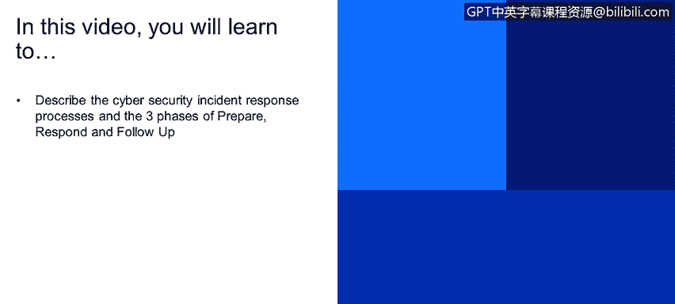
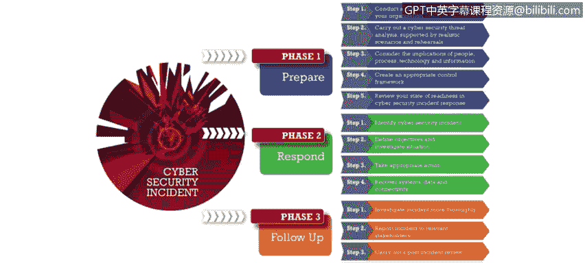
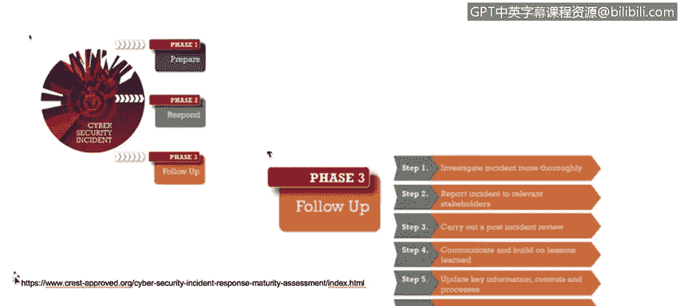
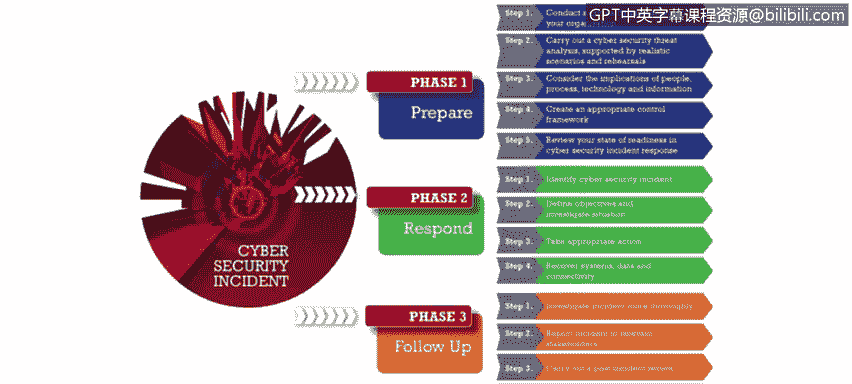
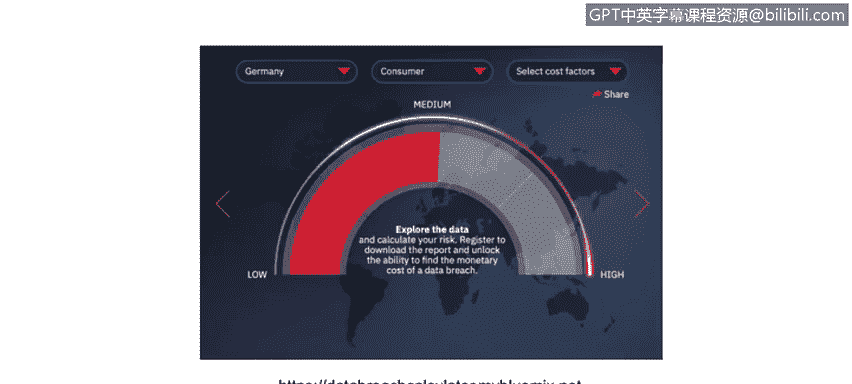
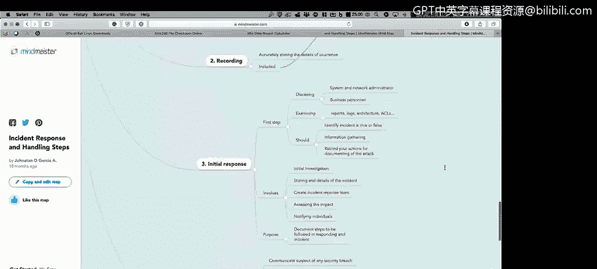

# IBM网络安全分析师专业证书课程1：《网络安全工具与网络攻击简介课程（IBM）》introduction-cybersecurity-cyber-attacks - P52：52_安全事件响应过程.zh - GPT中英字幕课程资源 - BV1c84y1Z7Dp

Yes。In this video， you will learn too。Describe the cybersecurity incident response processes and the three phases of prepare。

 respond and follow up We have how could we deal with the cybersecurity incident process this is something that came from CRest crest actually is a good organization that will have a lot of certifications a lot of information regarding cybersecur and they summarize the cybersecurity incident process in three different phases the first is prepared then we have respond and the last one is followup on the first phase if you will need to understand to have the edicover process in other words you will need to understand what kind of systems you are deal with if you have electronic data do you have that electronic data classified or do you have something important to worry about do you have controls do you have administrative or technical or physical。

Controls to protect your assets you have， for example。

 a business impact analysis that will allow you to understand what happens is if a certain system goes down how much how much money you will lose how much time you will lose on your operation for example。

 as soon as you have all the information in your hand as soon as you have all the data you could start dealing with the incident so first of all。

 in the face suit you you will need to identify what is a cybersecurity incident so for example。

 if somebody came here into your office and leave a USB key on your desk and you grab a USB key and plug it into your computer and you download a malware into your computer that's probably a security incident。

But if somebody goes and for example， trash a window in your building because throw a rock。

 that's probably not a security incident， that's probably well， it's a security incident。

 but not a cybersecurity incident。 So the way that you are going to deal with a cybersecurity incident will be different that the way that you are dealing with another kind of security another kind of incident in your organization。

Then you will need to start or trigger the business recovery plan。 You will start or you probably。

 you will need to trigger the business continuity plan if the incident may require that。

But the last part is decision of everything about on the past incident or the investigation phase and that's actually the followup you will to investigate the incident。

 why the incident happened if the incident will happen again， how you will deal with the incident。

 what are the best controls that you could implement in order to prevent the incident that happen again。

 so there is a lot of things that you could do on the followup others that it's important to understand or do in the followup phase is the trend analysis so for example。

 you know that somebody your organization grab a USB key and plug it into a computer in the internal network and a malware goes rolled your network and in fact a lot of computer so probably is trend if somebody again goes and leave USB keys on the parking lot for example。

What is the probability， what is the trend that a lot of people a lot of your users will grab the same USB key will go and plug the USB key into your computer。

 so in order to understand that that kind of activity that kind of behavior will be a trend do you have to probably perform a lot of interviews you will have to go and grab not evidence as we mentioned on the investigation face and create a case。

 create a business case create a process create a plan and one of the outcomes of that plan probably will be a security awareness problem so thats。

😡。

Basically， the faces of the cyber incident response plan， Cy incident response process。

Something good if you want to understand a little bit better how security incident could harm your organization。

 is this data breach calculator that we have here in IBM。 Actually。

 let's go real quick into this link。Do you go here and open this link。

You will get something like this and actually it's pretty pretty simple。

 You just need to select here， for example， what country do you are living or the cybersecurity incident will be happening。

 what kind of industry are you dealing with， for example。

 we could deal with the pharmaceutical industry and some of things that you already implement or you don't have on your of your organization。

 for example， you could say that you have an artificial intelligence platform and you have actually data classification schema and you have employee training and see as soon as I start adding new things into this factors。

 the number or the cost of the cybersecurity incident will low as soon as I start clicking。

On the factors and delete the factors from the link here from box that I have。

 the cybersecurity incident will be higher will be the cost will be higher and then here we have the normal statistics about how based again on our location the average time to identify a cybersecurity breach data breach for example。

 and the top three cost producing factors for mitigating data security breaches。

 so obviously the improvement is incident response。

 then we have a lot of or the use of encryption technologies in our data and our systems and obviously the employee training process。

And on the next slide， we have a couple of links also if you prefer to understand the cybersecurity incident process。

😡，Using a MImat， you could go to those links。 Those are actually pretty good。

 but you will have a lot of information here。 You will see a lot of things and probably will be overwhelming to understand this。

 but。

That's actually critical。 You will have here a lot of phases。

 a lot of steps that you will need to perform as soon as you start or dealing with the cybersecurity incident response。

 So， for example， here on the step number3。 This is the steps that you may need to follow on the initial response process。

 So the first step on the initial response， for example。

 is deciding is have the system and network administrator in place the business personnel examining the log。

 the reports， your architecture and should have， for example。

 information gathering gathering for the system understand the incident that you are dealing with。

 understand the system that you are dealing with in order to。Start working with the response team。

 Start working with the people。

