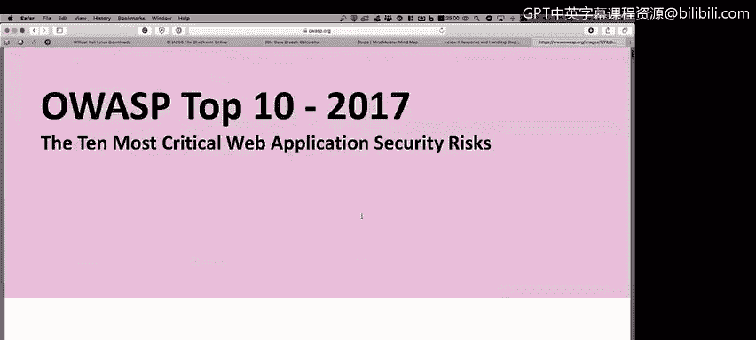
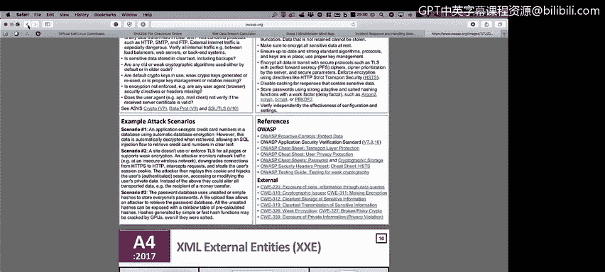

# IBM网络安全分析师专业证书课程1：《网络安全工具与网络攻击简介课程（IBM）》introduction-cybersecurity-cyber-attacks - P57：57_OWASP框架.zh - GPT中英字幕课程资源 - BV1c84y1Z7Dp

Yes。In this video， you will learn to。Describe the OWASs top 10 tests。

 when and why they are used and where to get help from outside organizations。

Another methodology， another best practice。 and most of the web applications needs to follow。

 Here's your top 10 process。 So if you are， if you're dealing with a web page。

 if you are dealing with a web application， you are dealing with actually not necessarily a web application。

 But if you're dealing with applications at all， you could use the O West top 10 and start performing test on each of the sections that these organization will have on their on their website。

 So basically O and。

We will see here a a lot of information on OAS if you go to Google and put OS on the search part。

 you will go to the O。org link and you will get a lot of information regarding this organization that will help you when you are trying to perform a test into your application into your web application。

 Actually， there is also a lot of information for mobile applications too， So， for example。

 if you go to。

To downloads， you will see a lot of categories here。 So， for example。

 let's go to the top 10 top 10 project here yes。And you will see that the 10 top 10 for 2017。

It's now available， so here you will download the report with all the different information for the top 10 vulnerabilities for the web applications on the last two。

 three years is 27 2017 So for example， we have as the number one injection。

 So we go to page number7。 here's an example of is what is injection。

 what is the process to get information for the system using SQL injection， for example。

 what are the attacks scenario areas， what are the queries that you need to perform in the system in order to know if your system is prompt or is vulnerable to injection and you have for example。

 here broken authentic， sensitive data exposure， you have a lot of things to test a lot of things to prove and again if you go to the main website you will see a lot of there something else known as。

checklist， it's a document where you will。😡，Get a lot of documents。

 a lot of a lot of controls that you will need to implement。

 You will need to have on your web applications in order to ensure that your system。

 your web app is fully secure。