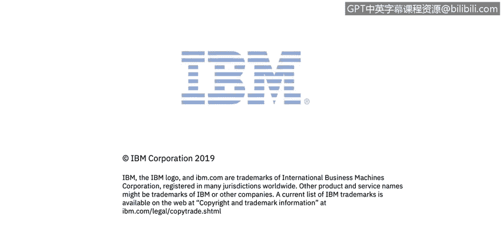

# IBM网络安全分析师专业证书课程1：《网络安全工具与网络攻击简介课程（IBM）》introduction-cybersecurity-cyber-attacks - P58：58_欢迎来到关键安全工具简介.zh - GPT中英字幕课程资源 - BV1c84y1Z7Dp

In module 4， Warren Perez， an S IEM administrator for IBM's managed Security Services organizationgan in Costa Rica。

 will give you an overview of some of the many security tools used in the cybersecurity field。

 Warren and John will then explain the use of these tools and give some examples。

 At the end of this module。 you will be able to describe the purpose of firewalls。

 Antivirus and anti malware， cryptography， penetrationration testing and digital forensics。

 You will also be introduced to two key resources， security intelligencetelligence dot com and Warren's article。

 incidentdent response and digital forensics。 Let's get to it。

