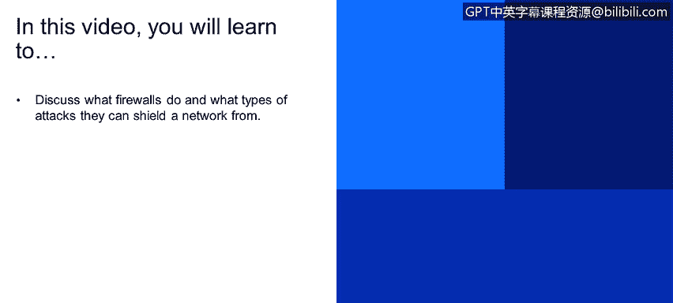
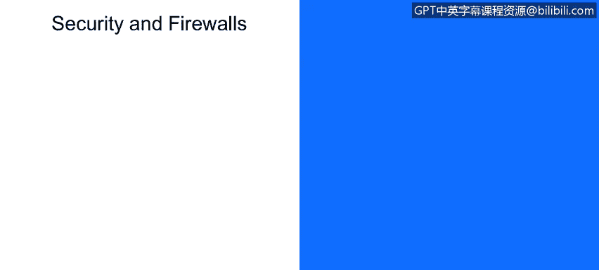

# IBM网络安全分析师专业证书课程1：《网络安全工具与网络攻击简介课程（IBM）》introduction-cybersecurity-cyber-attacks - P59：59_防火墙简介.zh - GPT中英字幕课程资源 - BV1c84y1Z7Dp

Yes。In this video， you will learn too。Discuss what firewalls do and what types of attacks they can shield a network from。

So let's start off with security and firewalls。

So firewalls， right？They are protection mechanisms that isolate organization's internal networks。

From the larger internet。Allowing some packets to pass and blocking others。

So firewalls right generally used in pairs externally for DMZs， separate。

The internal enterprise that has the application of security policies from the public internet。

Where WWW stands for Wild， Wild West that does not a shred of security applied to that。

So why would we want to apply fight right prevention of denial service attacks。

 there are two particular attacks， sin flooding and TCP connections。

Attacks and keeps things so busy that there's no resources left for real connection。Additionally。

 as opposed to this。S attack of。Attacks in the denial of service。

That an illegal modification or access of internal data。

 so this is a violation of the security policy。Content can be stolen right for data exfiltration。

 or for example， a organization's homepage could be modified and replaced for something else。

So fire rules also allow only authorized access。In conjunction with an access control module。

 we'll talk about that in a little bit to ensure that only authenticated users and hosts come through。

And there's actually two types of firewalls， application level packet filtering。

 there's a third called an XML firewall， but it's an XML gateway， we'll talk about that briefly。

