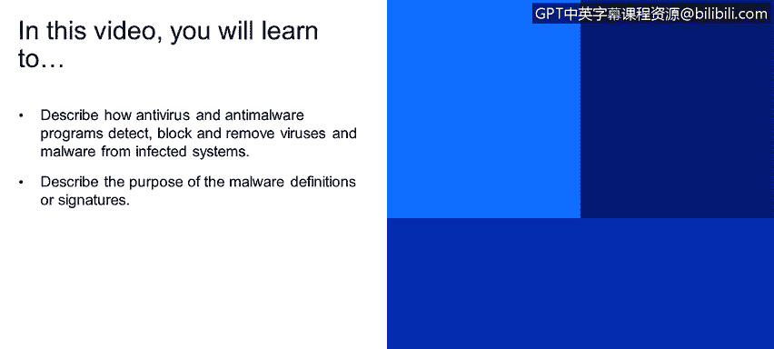
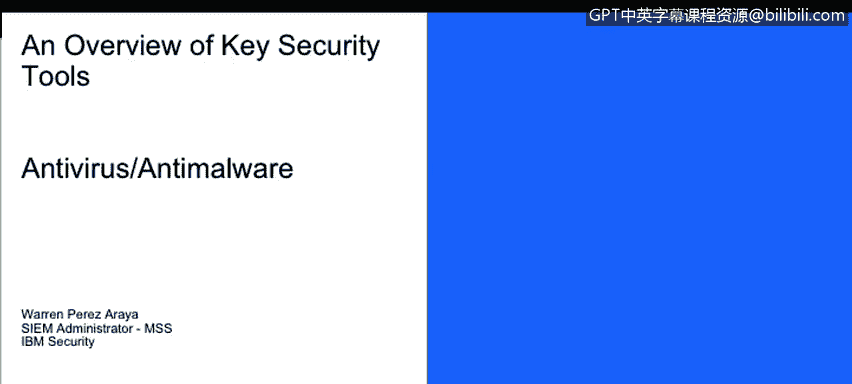

# IBM网络安全分析师专业证书课程1：《网络安全工具与网络攻击简介课程（IBM）》introduction-cybersecurity-cyber-attacks - P64：64_反病毒反恶意软件.zh - GPT中英字幕课程资源 - BV1c84y1Z7Dp

Yes。In this video， you will learn to。Describe how antivirus and anti malware programs detect， block。

 and remove viruses and malware from infected systems。

Describe the purpose of malware definitions or signatures Next on we will discuss a little little bit about antivirus and anti malware。

 so an antivirus is a specialized solve that can detect tech。

 prevent and even destroy computer viruses of malware。

This specialized over use malware definitions。 They're basically like signatures for identifying malicious software or malware。

Those malware definitions are constantly being updated by vendors and easily the vendors are the ones that have sent out these updates or these modelware definitions to the antivirus server itself。

 they basically scan the systems and they search for matches against those malware definitions。

 so for example， we get one file infected， it will actually match a hash， for example。

 a MD5 hash that is's already recognized as a malware。So the antivirus will either delete that file。

 put it in quarantine or just alert the end user to alert the end user that this size is infected or might be infected。

 Antivirus can sit on locally in a computer like a host antivirus it could also be a narrow antivirus system。

 The most common one that will encounter it' a host based antivirus system that is actually connected to a centralized server。

