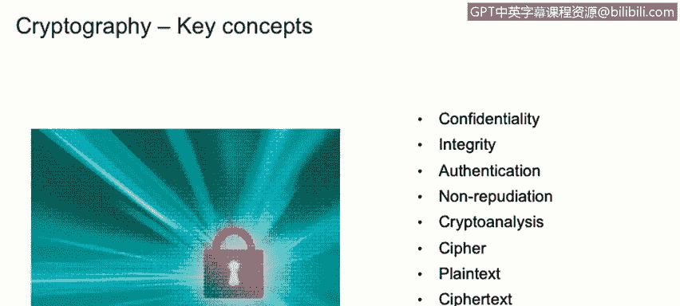
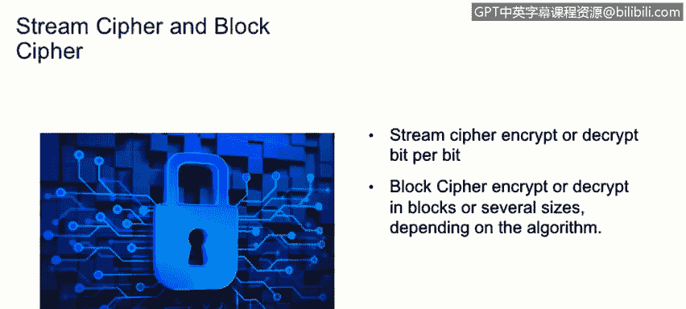

# IBM网络安全分析师专业证书课程1：《网络安全工具与网络攻击简介课程（IBM）》introduction-cybersecurity-cyber-attacks - P65：65_密码学简介.zh - GPT中英字幕课程资源 - BV1c84y1Z7Dp

Yes。In this video， you will learn to describe the purpose or use of cryptography and cybersecurity。

Describe how cryptography is used to assure the key cybersecurity tenets of confidentiality。

 integrity， authentication， and non repudiation。

One key concept of security crytography and we'll discuss this。

Now。Crypttography is basically a way of secret writing。

 it's secure communication between two parties and only the intended recipient can understand this communication。

 or that is the key task of cryptography。One thing that we need to understand for cryography is that there' is data at motion and data at rest。

Both of them need to be secure。Cpttography is nothing new。 It had been used for thousands of years。

 Exles， addition。Hyroglyphics is importantpart。Cs of cipher。

 this are just a few examples of the ancient cryptography。

 and nowadays is just a more evolved way of encrypting data and with the。

Rice of computers competitor has evolved over the years。

To understand better cryography and why is important， we need to discuss some key concepts。

 We'll start with confidentiality。 Basically， confidentiality is the process of assuring that only the intended parties can read and understand the message。

Integrity is the process of。Actually， detecting me， the message message has been changed。

Whether the message has been altered in any ways in the process of being transmitted。Authentation。

 it's actually the process of identify or authenticated someone or something。

 It's actually allowed to do something or if something。Or some message is actually correct。

Nonreudiation is the process of detecting if something or someone has done something， and。

That someone cannot deny that action or that message， which was sent by him or her。

Cryptto analysis is just basically the process of analyzing cphers and cryptographic algorithms。

 cryryppt analysis is a key factor to cryptography because it allows scientists and mathematicians to actually。

Determine if a cryptographic algorithm is secure or not cipher is the actual algorithm。

That encrypts a message， for example。The Casar cipher was an instrumentous cryptography algorithm that basically shifted the alphabet or shifted specific letters either to the right to the left n amount of times plain text。

 it's a like the word says is's just plain text that can be humanly readable。

 The ci text basically refers to the the plain text gone through the cipher。

 is basically all the plain text has been。The site has been assigned to a plain text and the site actually is something that it's not humanly readable。

 Incryion is the process of transforming plain text into server text。

And the encryptryption is the process of transforming the cyber text into the plan text using the cipher as well on those two key concept。

 let's talk about cryptographic strength a little bit Now， cryptographic strength relies on math。

 not secrecy。 keeping something secret does not make a cryptographic algorithm any more secure。

Actually， the most secure algorithms out there have they have stood the test of time are public algorithms modern Cypherers use modular math on the right side of this on the left side of the screen。

 you will see some exclusive X or table， you will see column A B and the column A X or B。

 so try to explain this with a bit better column A will be the plain text column B will be the。

The key that we' use to encrypt the information and the column see will be the resulting。Cypher text。

 If you do the other way around， you have the column A X or B， meaning you have the cipher text。

 and you run that on an X or based on column B， which will be the key。

 You will end up having column A will be， which is the place that you plain text。 Now。

 let's talk at a little bit about two type of ciphers。

 There's stream cipher and there's the block cipher。

 St ciphers encryptpt or dec the information bit per bit， meaning one battery at a time。

On a extreme manner。Blolock ciphers， they encrypt or decrypt the information differently。

 They actually use blocks of bits or bytes to encrypt the information。 Some algorithms use。

 let's say， 64 Bs。Of information to encrypt at a time。

 So blood si will encrypt the message 64 bits at a time。

