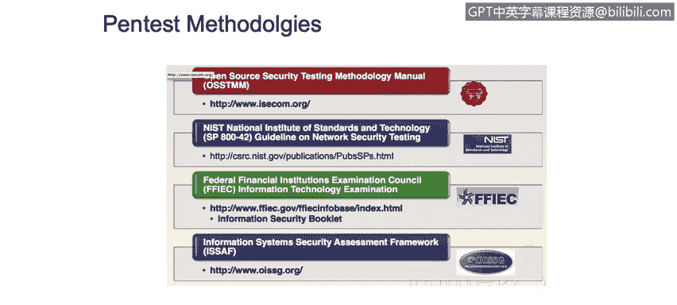
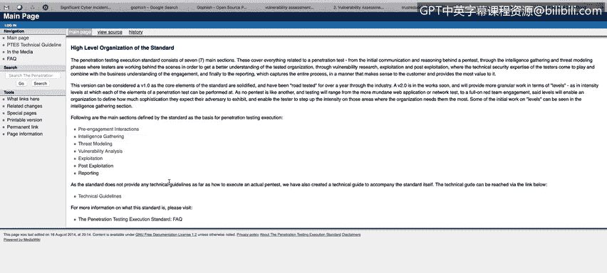

# IBM网络安全分析师专业证书课程1：《网络安全工具与网络攻击简介课程（IBM）》introduction-cybersecurity-cyber-attacks - P70：70_渗透测试方法.zh - GPT中英字幕课程资源 - BV1c84y1Z7Dp

In this video， you will learn too。Describe the methodologies used in penetration testing。

 including the following。Open source security testing methodology。

National Institute of Standards and Technology guideline on network Security testing。

Federal Financial Inutions Examination Council， Information Technology Exa。

Information System Security Assesment Fwork。Let's talk about now pan testing methodologies so when we talk about pan test methodologies。

 we're talking about a process for offensive cybersecurity consultant to perform a series of actions in order to try to exploit a system。

 but the exploitation process actually is one of the key parts of the methodology is something that will give you a clear understanding of how the company。

 how your victim or your client is dealing with the cybersecurity war is dealing with a cyberseity defenses and monitoring processes。

So let's understand first a couple of methodologies that are on the public knowledge or are in the environment for you to understand and follow。

 so we have the OSSTMM methodology， the open So security testing methodology manual。

Then we have the list methodology for a network security testing。

 There is another one called the federal Financial Intit Ex Council for information technology examination。

 and then we have the EF information System security assessment framework There is another pen test methodology called a P testest actually we go here and put on Google the P test technical Highlines the actual URL is a pen test www do pen test standard。

 org if you go here。

You will see a lot of things。 You will see。A lot of information from the pan methodology perspective。

 but you in order for you to be able to read this methodology actually is one of the simplest methodology out there。

Is it's it's simple。 Just understand that here is here here you will have the the phases。

 So each of this is a phase that you will need to explore。

 You will need to to perform on your pens project。 So， for example。

 when you are in the intelligence gatheringing process。

 you can click here and you will you will have a lot of things for to perform in order in order to you get enough knowledge from your target。

So in the real world， if you work as a penester as an ethical hacker。

 the first step and the most important step that you could do is the information gathering process。

 the enumeration process understand all the attack surface from your client understand all the possible exploits or all the possible systems that you could exploit on your target。

 So normally there is a misconception because in some occasions the people thinks that pen tester will just go and open something called meta and start working with commentss and exploits and that's all。

 I mean， that's not the real world on the real world you will need to get a lot of information from your target。

 a lot of enumeration， a lot of information gathering from your target in order to proceed with the other phases。

 Then when you have。Enough information you could go and start your tread modeling process so you have all the information from your target now what now you need to understand what will be your your your roadmap sorry in order for you to exploit or attack your target Here is just some examples or checklist or things that you could start doing on your end in order to understand which which part of the organization which part of the network that you already understand because you already performed the information and information gathering process but you start exploiting exploit more deeply in the next step。

 the next step actually is the vulnerability analysis in some cases we use as a pan testers we use vulnerability scanners to vulnerability assessment tools for understand a little bit better which vulnerabilities are more likely to be exploitable in the system。

So， for example， if we have something on port 80 and we already know that that thing on port 80 is a web page running on Apache server version 2。

6， for example， one of the things that we could do is try to perform exploration regarding vulnerabilities that will affect that version of Apache server。

 So we could use a vulnerability assessment tool， we could use something called， for example， Openb。

 we can use Qies， we can use asus， there is a lot of vulnerability assessment tools over there。

 But one of things that also it's important for you to understand is if you could also explore the vulnerabilities using a manual process。

 So one of the things that you could do is just go to Google。

 And if you have the version of the system， just go and type exploit Apache2。2。4， for example。

And you will have a lot of information about vulnerabilities that will affect that specific version of A patchache server。

 and you could start trying to exploit those vulnerabilities in the next step。

 the next step actually is the exploitation step。So when you are in the exploitation， you will need。

 first of all， to understand that you， as a pen tester or as a ethical hacker， you you again。

 you cannot exploit any system if you don't have the permission to do that。

You need to coordinate with your client， you need to coordinate with your bit。The timeframe。

 the time windows in order to perform the exploit of the systems， I。

 because what happen if you exploit something if you exploit the Apache web server that we were talking about minutes ago in a time where you' bit your client is performing some important actions on the webpage。

 for example， in a high season of sales for that that will take over the internet。

 so if you exploit the system and you not just get access into the system。

 but you also probe the system because you perform denial of service attack。

You probably will have problems， because。The operation， the normal operation of the client。

 it' effective for you。 So that's an important part for any pen tester to understand coordination。

 talk with your client Op， try to coordinate all the operations from the exploitation phase is a key part。

But again， on these Ps or penas standard methodology that were。See in here。

 there is a lot of things that you need to have in mind。 So， for example。

 if you want to send a payload with a reverse connection to your system。

 probably you need to deal with something called evation or overfucation to try to avoid anti antivirus detection。

 for example， or if you want to encrypt your payload or your attack。

 you could start doing something that will encrypt your connection， for example， using。

Netcat with encryption or using other tools that are not necessarily encrypted。

 but will use encryption ports or reuse ports that are open on the system。And lastly。

 we have the post exploitation and reporting again。

 the post exploitation is what happened when you already have access to the system。

 how could you maintain the access， how could you start doing some pivoting， in other words。

 how could you start jumping from computer to computer or how could you start doing something that we call privilege escalation and the most important part here reporting。

 how could you show your client， how do you perform each of these steps of the project and gain access to the system。

