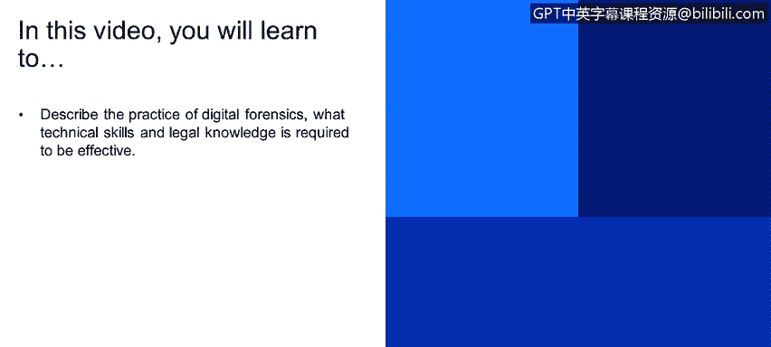
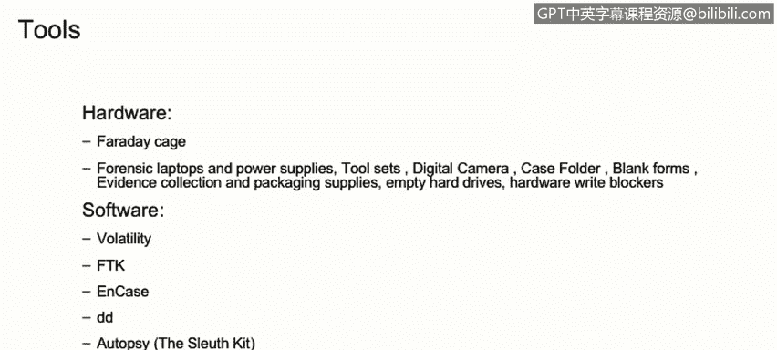

# IBM网络安全分析师专业证书课程1：《网络安全工具与网络攻击简介课程（IBM）》introduction-cybersecurity-cyber-attacks - P72：72_什么是数字取证.zh - GPT中英字幕课程资源 - BV1c84y1Z7Dp

Yes。In this video， you will learn to describe the practice of digital forensics and what technical skills and legal knowledge is required to be effective。

We move now on to the digital forensics area。So digital forensics， it's a branch of forensic science。

It basically includes everything related to identification， recovery， investigation。

 validation and presentation of facts。Regardingverting digital evidence， theres digital evidence。

 It's usually fun on computers or similar digital storage you devices， for example， hard drive。

Cell phones， servers。If we talk about forensic science。

 we need to talk about the local exchange principle。Dr。 Edmund Loer， it' a pioneer。

In the forensic science scene， and he became known as the Church Hol of France。

 He came up with this principle that it's true for the physical world。

 as well as the technical world。Or the computer world。

The perpetrator of a crime will bring something into the crime scene and live with something from it。

 And that both can be used as forensic evidence。Basically。

 this means that when anybody commits a crime。😡，You will take something from the crime。

But it will also leave something in the crime scene。

 And those two facts can be used for forensics evidence。In digital forensics。

 we need to talk about chain of custody just as we will in the forensic science。

 basically refers to the Kron what you call documentation or paper trail that records the sequence of custody。

 control， transfer analysis， and this position of physical or electronic evidence。

 so the chain of custody basically it's a written document that it will allow us to reconstruct what have been done with the evidence。

Who has had it in the past， Who has copied the information， how it was Scied。

 Who was analyzing the information。All sorts of things。

 the chain of cutti will be able to tell us that or recreate that for us。

 This chain of custody process has been required， or it is required for any type of evidence to be presented legally in in court。

In Digital Joe forensics， we have several tools there。

 we can divide it into two hardware tools and software tools In hardware tools。

 we have a few examples of the Friday page。It's basically a device that can block any electronic。

Or it basically blocks magnetic fields。 it is used to isolate cell phones， for example。

 from the cellular data， Wifi axis so it will isolate the cell phone from any impulse or any electronic communication。

We also have a specific。Forensics tools or forensics briefcase that have a bunch of tools inside of them。

 we can discuss them maybe it's forensics laptops， power supplies， tool sets， digital cameras。

 case folders， blank forms in this block and this basically this blank forms are while will then constitute the chin of custody of any evidence collected during the investigation。

Also， we will need some empty hard drive。 If We need to copy any information and also the right blockers。

 because we want to make sure that we are able to copy anything。From the hard drives。

 But we're not writing anything into the hard drives。We have several software tools out there。

 and this is just a very。Small list of anything that is available out there。

 We have open sourcing applications， like volatility。And we also have paid software。

 like FK and end case。In the case of DD， this is basically a bit by bit crop year found in most of the Linux operating out there。

Autopsy， bulk bulk instructor and many more are some of the tools that can be used in any forens investigation。

