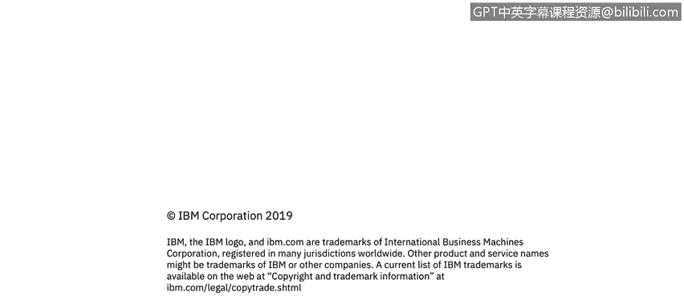

# IBM网络安全分析师专业证书课程1：《网络安全工具与网络攻击简介课程（IBM）》introduction-cybersecurity-cyber-attacks - P73：73_总结.zh - GPT中英字幕课程资源 - BV1c84y1Z7Dp

Additional courses， specializations， and a junior cybersecurity analyst professional certificate will be available soon to continue your journey into the cybersecurity workforce。

We hope to see you again soon。

