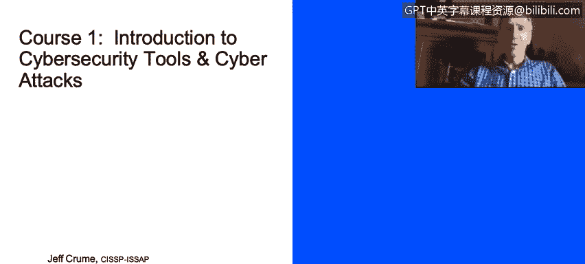

# IBM网络安全分析师专业证书课程1：《网络安全工具与网络攻击简介课程（IBM）》introduction-cybersecurity-cyber-attacks - P74：0_01_introduction-to-cybersecurity-tools-cyber-attacks.en_subtitled - GPT中英字幕课程资源 - BV1c84y1Z7Dp

Hi everyone， this is Jeff Crew。 I'm a security architect and distinguished engineer with IBM。

 been with IBM for 36 years and most of that has been spent in the security space。

 I've been interested in this particular topic all the way back into high school where I spent most of my afternoons in the lab doing hacking and trying to figure out how to how systems worked and how they would break and how you could defend against attacks and all of those kinds of things so it's been a fascinating topic for me always as long as I can remember and hope you'll find it to be so as well。

 so welcome to this course and I hope you'll find it interesting。

We're going to move on to the next slide， which refers to the challenge that we face currently in the cybersecurity space and the challenges are significant。

 In fact， most of these challenges have been true for a long time。

 and I suspect will continue to be true for a long time moving forward。

 which is one of the things that makes this such an interesting space and such a good place to develop and spend your time developing skills in。

So for instance， the threats continue to increase， that's been the case for as long as we've been interconnecting computers across the internet。

 the threats have continued to increase， there's no reason to think that that's going to change。

 There's an increasing incentive for the bad guys to try to hack and why is that， well。

 because more and more we're putting important information， valuable information。

 resources that have actual monetary work。On IT systems。

 So as the famous or infamous bankropper Willie Sutton was asked why do you keep robbing banks。

 he said because that's where the money is， well， if Willie Sutton was robbing banks today。

 you'd probably be on IT systems and be a hacker because that's where the money is and it will continue to be the case So the threats continue to increase system gets more complex。

 which also increase the threat space and increase the size of the target that we place on these systems。

The alerts that we get can continue to increase。 In other words。

 the notifications that people are attacking and doing certain techniques using different types of attack vectors that continues to change and morph。

 We have some general themes that continue， but the details of the attacks will continuously change。

Unfortunately， those things are good for the bad guys， for the good guys。

 the number of analysts is down， and I'm you see a statistic down at the bottom of this slide in particular that talks about a skills shortage that we're projecting that by the year 2022 that will be 1。

8 million unfilled cybersecurity jobs。Now that's a lot。 Some people will argue and say。

 well that number is exaggerated， so let's cut it in half。

 let's say it's roughly a million just in terms of round numbers， that's still a huge number。

 That means if you have the job wrecks to go out and get the skilled people。

There are simply not enough skilled people， and we can't create cybersecurity experts fast enough to meet that demand。

 Now， you may watch this course that this is being recorded at one point in time。

 So anytime you put statistics like this out there。 There's always a risk that in the future。

 the odds are that the dynamics will be somewhat different。

 I suspect this is going to be a problem for us going forward。

 So we're going to need a lot more cybersecurity experts in the field to accomplish what we need to be able to accomplish。

 and they're going to need more and more knowledge。

 The knowledge that's required in order to deal with the more complex attacks continues to increase。

And then unfortunately， we have less and less time to work on these because literally time is money when it comes to these attacks。

 the longer it takes you to respond， the more it will cost， the more data that gets leaked。

 the more damage that's done， and in some cases， when we're talking about compliance regulations like the generalized data protection regulation from Europe。

 GDPR。If you don't respond quickly enough and notify all the people that need to be notified of a breach。

 it will cost your company significant money as well in terms of fines。

 so all of those things taken together really come up to one inescapable conclusion that we need more cybersecurity skilled individuals to help deal with the threat。

And so what do these folks need to do on a regular basis Well if you're a soC by the way。

 as a security operations center so that's sort of the control center。

 the nerve center of where we receive the security information and event management information that's the acronym you see there SM that refers to bringing in all the alarms and security information into one place so we need to be able to see those events on a console。

 see the incidents， which ones of them are important and which ones of them aren't that's a huge part of the triage that goes on here and in doing that triage we have to decide is this something is this a real thing or not if it is then I need to do more investigation if it's not well then I can move on and maybe I want to classify it so that I don't waste time on those similar types of information and alarms that come in in the future so we're constantly wanting to tune this to our environment so that we don't waste time where we're productive with what we do you want to be able to。

Do the investigations in some cases that involves using all sorts of different security tools。

 you may have lots of different consoles， although we're more and more about trying to create an integrated hole so that we can bring in the information from the data layer。

 the operating system layer， the network layer， the application layer， the identity layer。

 bring all of those in an integrated way together but in many cases these indicators of compromise may occur from on different systems and we need to be able to bring them all together so being able to be skilled at doing searches doing investigations having a curious mind that can go out and piece together all the different threads that we have into an integrated hole and start building a narrative around okay this happened and then that resulted in this and then we have this happen and now what we have is not a single incident but we have a large malware campaign for instance。

 that is affecting lots of systems and the way we mitigate and orchestra。

our response to that then well become the next skill that we really have to focus on so first job is identifying the problem。

 then trying to discover the extent of that the risk that's involved in it for instance how big of an impact does this have on the organization and then ultimately what kind of response do we do with this can we automate some of the response for the future is this something that we will have to deal as a oneoff are there individuals that we need to notify to get response to this particular problem do we have to work with other partners whose systems may be connected to ours our IP upstream do we need to have them put blocks on the network to get rid of the bad stuff do we need to install new tools that can help us do mitigations in the future so you can see there's a lot of different kinds of things and not' only touch the tip of the iceberg but again I'll say to you。

Because it's a fascinating area， it's one that is constantly moving， if you like a challenge。

 if you like hard problems， this is a good place to work。

 and I hope you find this information in this course useful。

