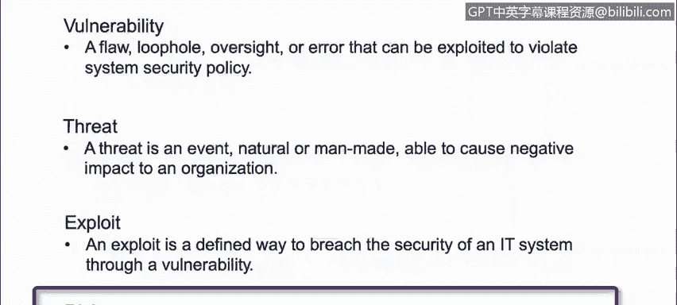

# IBM网络安全分析师专业证书课程1：《网络安全工具与网络攻击简介课程（IBM）》introduction-cybersecurity-cyber-attacks - P77：3_02_key-terms.en_subtitled - GPT中英字幕课程资源 - BV1c84y1Z7Dp

Yes。In this video， you will learn to describe what these four key terms mean and the context of cybersecurity。

 vulnerability， threat。

Exploit risk。Section， we will review four key terms。Vulnerability， threat， exploit and risk。

A vulnerability is a flow， loophole， oversight or error that can be exploited to violate system security policies。

 for example。A software or an application that has code vulnerable to a over overflow exploit。

Thread is an event natural or manm， able to cause negative impact to an organization。

 it could be a storm or a hurricane or a hacker， for instance。

An exploit is a defined way to breach the security of an IT system through a vulnerability。

Like the buffer orflow example that I gave you before， an exploit could be。

A piece of code available on the internet to execute such attack against an application that happens to be vulnerable and a risk is the probability of an event or that an event could actually happen in this case the likelihood a vulnerability to be exploited。

