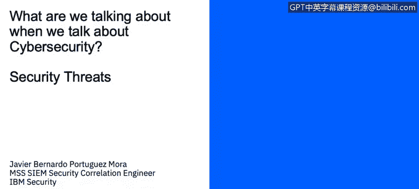
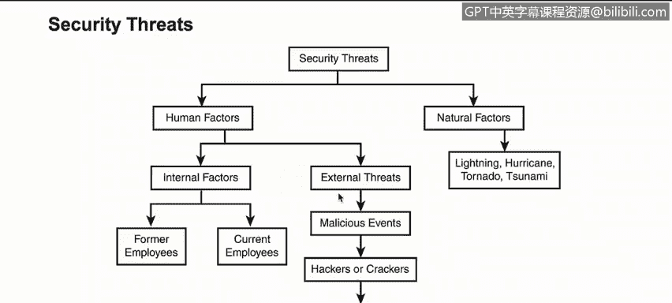

# IBM网络安全分析师专业证书课程1：《网络安全工具与网络攻击简介课程（IBM）》introduction-cybersecurity-cyber-attacks - P78：4_03_security-threats.en_subtitled - GPT中英字幕课程资源 - BV1c84y1Z7Dp

Yes。In this video， you will learn to describe the categories of human factor and natural factor security threats。

Continuing with the security threats， now we have this is specific tree that explains a bit more about different categories that we have for human factors and natural factors。

 basically we have internal factors and external threats。

For the internal factors， we have former employees and current employees。

This is very important because most of the attacks and that are actually detected or that are critical for on organization come from internal factors like internal employees Also former employees are a threat because they。

They used to have access to internal resources， so if they are not properly offport and the accounts are not properly disabled。

 then they will represent a threat for the organization。

 they also have knowledge about how the organization works， how the internals are executed。

 so they certainly represent a huge factor， then we have the external threats。

 we have malicious events like for instance an attack come from a specific country targeting one of our DMZ servers。

 hackers or crackers。These guys who try to exploit vulnerabilities。

 they try to find a way to get in and viruses Trojans or worms。

 which are just different attack vectors to compromise an organization all these are human factors because they either interact with humans or they are developed by humans for instance a virus is developed by a hacker to take advantage of a specific user。

 but also a user in not。Negative or harmful way。Access to get access to something that compromised the system with a virus also we have the natural factors like lining。

 hurricanes， tornado， tsunami， all those are important to consider。

 especially when we design business continuing plans and disaster recovery strategies。

