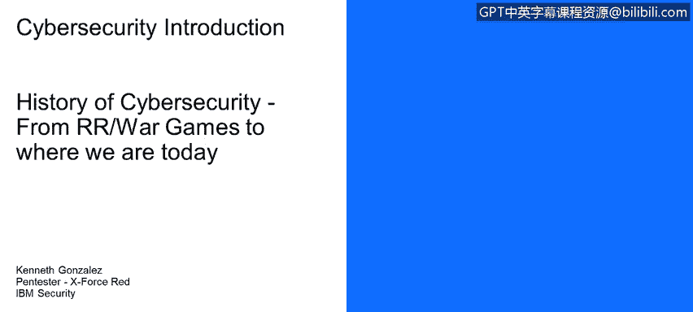
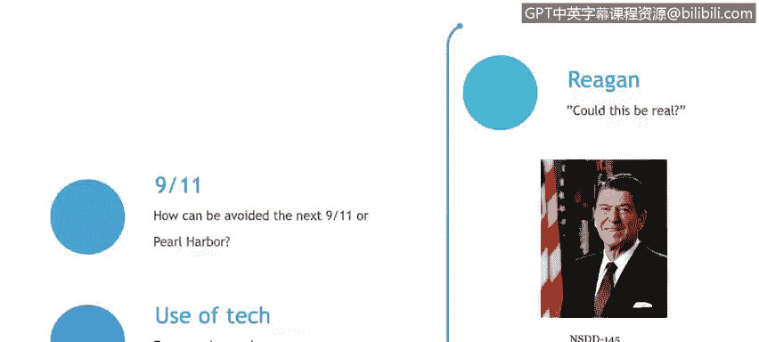

# IBM网络安全分析师专业证书课程1：《网络安全工具与网络攻击简介课程（IBM）》introduction-cybersecurity-cyber-attacks - P81：7_01_from-ronald-reagan-war-games-to-where-we-are-today.en_subtitled - GPT中英字幕课程资源 - BV1c84y1Z7Dp

Yes。In this video， you will learn to describe how the movie War game spurred U。

S President Ronald Reagan to create the first national policy on cybersecurity。

 describe how 9/11 and the increasing use of computers and smartphones has impacted the need for robust cybersecurity。

So how these cybersecurity processes start， how the governments evolve or how they start into the cybersecurity arena。

Everything starts with Ronald Reagan， Ronald Reagan was a United States president that also was a Hollywood actor。

 and he asked to their security personnel， to their security advisors。

If something that he saw in a movie could be， could be real。What movie。

 let's take a quick look into the into the movie that Reagan saw and he ask。To their advisers。

We're in。It thinks I'm falcon。Hello。I' ask you that it'll ask you whatever it's programme to ask you。

 you want to hear a talk， yeah。I'll ask it how it feels。I'm fine。How are。いう。

Excellent18 long time Can you explain the removal of your user account on June 23， 1973。

 It must have told he died。People sometimes make。Mistakes yes， they do。 How can I talk？

It's not a real voice this box just interprets signals from the computer and turns them into sound shall we play a game。

Oh。So that movie was war games。 It's a pretty old movie， actually。

But the main argument of the movie was that someone， actually， that teenager hacked into a computer。

 into the Pentagon。Start a game with the computer， the main computer of the Pentagon。

 the artificial intelligence that runs that computer understand that this is a war game。

 but it could or actually use the real missiles and the real nuclear arsenal。

 so a teenager from the home from their home office from their basement hack into a computer into the Pentagon and take the ownership of the missiles from their home。

 so Ronald Reagan ask their advisors， this could be real， this could be happening right now。

 so they start working on something they actually work on the first policy for a cybersecurity field in the United States that it's called the national policy of telecommunication and automated information systems security。

DidD155。Then。We jump to the 911。 As soon as the 911 happened。

 a lot of people into the US government start asking。How can we。Avoid the next 911。

 How can we avoid the next cyber threat that will cause an interruption of， for example。

 the lining system， a power plants energy system on the United States field and the last part of this history class is the use of technology 30 years ago。

 40 years ago， nobody has a computer in the house right now everyone has at least a computer and at least one cell phone。

 one smartphone on their house so there is a lot of people。

 there is a lot of technology over there and there is a lot of information that could be shared could be stolen and could be compromised using that technology。

