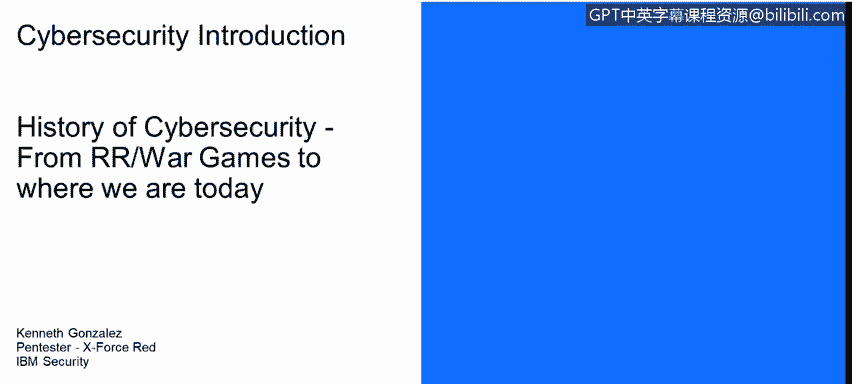
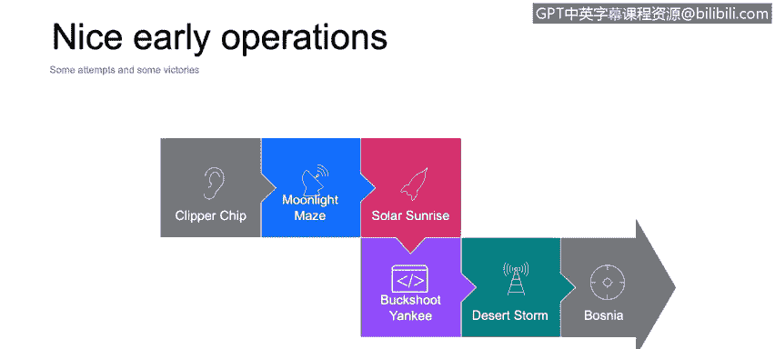

# IBM网络安全分析师专业证书课程1：《网络安全工具与网络攻击简介课程（IBM）》introduction-cybersecurity-cyber-attacks - P82：8_02_the-impact-of-9-11-on-cybersecurity.en_subtitled - GPT中英字幕课程资源 - BV1c84y1Z7Dp

Yes。In this video， you will learn to describe the second major factor that contributed to the rise of cybersecurity attention in the US the next step or the next big thing that happens that changed almost everything for the last 2 years was the 9/11 The 9/11 obviously was something fiscal was couple of planes that crashed into into the twin Tower in New York。

But one of the things that the USS government tried to understand also was， first of all。

 how this could happen， how the coordination between different parts happens。

 and what happened if there is a 9/11， but not necessarily on the physical world。

 but on that technology， something like the destruction of the power plant or the destruction of electricity network or the power network into or in any major or important city。

And one of the important things to keep an eye on right now its the use of technology for almost anyone。

 So basically anyone right now has a cell phone， anyone can access data。

 anyone can upload and download data from the Internet and we are going to talk about this specific topic in a couple of minutes。

 but that's something important to understand we have access to the technology in those years in the recent years。

 not everybody has access to that technology， but right now anyone could actually start an attack using their cell phone using their computer their computer in their home。

 So that's something important also to understand the use of technology。

Here we have some nice early operations regarding cybersecurity in the nation states or a cyber cyber war to be specific。

One nice operation was Cpership operation developed by the NSA and in simple words。

 this operation was something that those guys in the NSA tried to incorporate like chip into any landline from for phones in most of the U homes。

 to try to aspire their communications， obviously that project that operation didn't go well。

 didn't receive any approval from the Congress， but since the last leaks from Edward Snowden we already know that well it's not Cpership。

 the operation that goes into operation， it was something different that cash。

 not just communications over the landlines but also communications over emails and other other communication methods。

Moonlay Maze was an operation actually that's pretty。

 pretty important to understand in the year 2000， a Newsweek report created a series of reports regarding the Moon Maze story。

In simple words， this Moon Ma's operation was the process to collect or dump passwords from Uniix and Linux servers。

 not just from the NSA， but also from the NASA， the Department of Defense and a couple of other organizations in the United States。

 this operation was one of the first things that happened on the cybersecurity warfare arena。

 because well at this moment there is no indicator or there is no real accusation for nation or for someone in another country that performed thist。

 but it's supposed to be the Russians that performed these operation。

 and the tool that they used to launch this attack was something called Lock to and one particular thing that happened with this operation is the attackers used a lot of fxies。

So they infect computers around the world， especially in United States， and they。Hi。

 theyre real connection using that computers using those computers。 So when they start sorry。

 when the U government start looking and monitoring the notarized access and the activities for on those networks on the NSA on the NASA and the Department of Defense networks。

 they collect information not from from the real attackers。

 they they collect information from the proxies that the attackers are actually using。

Another operation， the solar sunrise。 This operation is important that。

He has or this operation has one interesting component here。First of all。

 this operation was a series of attacks to the Department of Defense Computer Networks It launched on February of 98。

Essential they exploit a known vulnerability on one operative system on the network of the Department of defense and they use or they start the attack fall in a series of steps。

 actually that's part of the interesting part of the operation。

 they try to determineinate understand if the vulnerability that the attacker wants to exploit。

 exists on the network， if the vulnerability exists， they exploit the vulnerability。

 they implant in a program like back door or a sniffer to to gatherator data or to get information from the network。

 and they actually lift the system lift the back door and the sniffer there and return later to retrieve the collated data。

They launch the attackers launch， not just this attack for the Department of Defense Network。

 but also for the Air Force， Navy， the Marine Corps and also in other countries such as Israel。

 France， Germany and。They target some of the key parts of the network。

 They try to dump also passwords and documents from the。

Technological or from the infrastructure on the。Infra on the。On the networks that they attack。

But the interesting part here is who you launched this tech。 It was something， I don't know， maybe。

The terrorists， maybe arogue state such as Iraq or something like that。 Well， no， actually。

 the attack was launched by two teenagers from California。 and actually。

 one of the teenagers was from Israel。 So this is a good example of。Things that could happen。

 even if we are not dealing with the nation state cyber command。

What things could happen if we do not secure our network。

And the breach of Yaee was categorized as the most significant breach of the US military computers ever by the Secretary of Defense。

 William J L。And they were， this operation was。Was。

Was part of a series of compromises on the year 2008。

And then everything starts with USV drive inserted into a computer in the Middle East military based operation。

 they use Trojan called agent BTC， and Trojan， the worm。

 keep or stay on the network for 14 months until the IT security staff from the military clean the infection。

 no one at this moment has attributed the attack。It seems like it's from China but there is no real accusation right now on the courts。

 so that's one important major security breach and security operation or cyber warfa operation from the last 10 to 15 years then we have some other examples。

 storm operation on the early 90s and the Bosnia war。

 those two are actually wars are not necessarily cyber wars but there is a component for the cyber cyber war for example on the De storm some of the radars thatsam used to try to alert their military forces that airplanes are coming to destroy base or things like that。

 some of the radars are destroyed or tamper with fake information， so that's one of the things。

that the U military command used to successfully attack some of their key military buildings or Sadam Hussein and from Bosnia on Bosnia。

 there was a lot of cyber operations， but things like， for example， fake news。

 fake information delivered to militaries in the field， things like that was used in Bosnia。

