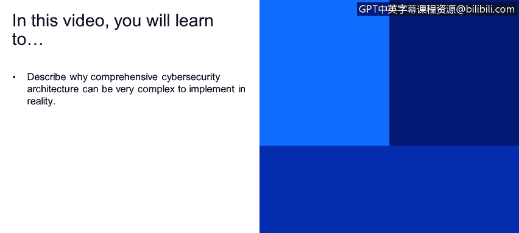
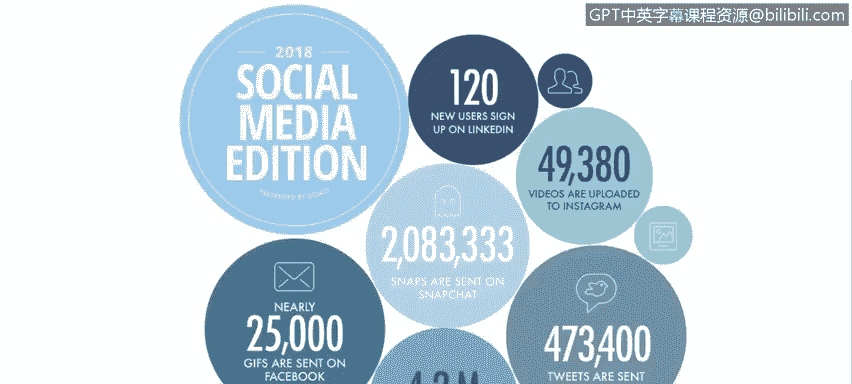
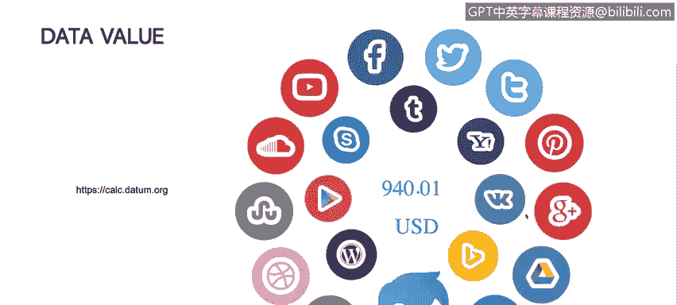

# IBM网络安全分析师专业证书课程1：《网络安全工具与网络攻击简介课程（IBM）》introduction-cybersecurity-cyber-attacks - P84：10_01_cybersecurity-introduction.en_subtitled - GPT中英字幕课程资源 - BV1c84y1Z7Dp

Yes。In this video， you will learn to describe why comprehensive cybersecurity architecture can be very complex to implement in reality。

 So let's talk now about how the internet works and why the online security is so hard to implement and to maintain。

First， it's important to understand what is what is the current picture that we are that we are having on our online presence。

 This is a report summary actually of the report presented presented by Domo on 2018。

And here we could see that there is almost， for example， nearly 25。

000 give are sent on Facebook Messenger， that's a curious fact， actually there is a lot of tweets。

 almost423000 tweets are sent on Twitter and 4。2 million or videos are vieweded on the Snapchat。

Why those numbers are important， these numbers represents that everybody。

 everybody that has a smartphone that has a computer are on the Internet are sending and receiving information from not just web servers but from another people in the Internet。

 so those numbers that the interesting part here is those numbers are minute numbers So every minute to 4。

2 million of videos are seeing on the Snapchat， every minute。

 25000 GF are sent into Facebook so there is a lot of data there is a lot of information that we are using and we are dealing with Internet right now。

Quick example and something that it's a nice exercise to perform。The tomb。

 it's an organization that collects and。And understand data around the world。

 They try to analyze data using big data technologies and artificial intelligence and things like that。

They put together a site where you can calculate how much or how much or what is the cost of your information over the internet。

For example， with a couple of clicks saying， for example。

 that you have a Facebook page that you normally send tweets that you receive or you have a personal blog on Wordpress or something like that。

 We can estimate that the information that you already have on the Internet cost almost $1000。

 So that's something important because normally we didnt or we don't actually pay attention to the information that we share or we have on the Internet。

 And that's one of things that we need to understand in order to。Implement controls on our accounts。

 We are going to talk about authentication。 Were going to talk about identification and the methods that we could use to protect our information。

 not just on the business side， but also in our personal digital life。 So that's something important。

 We need to understand the amount of money that we are。Put in the table for the attackers。

 for the cyber crime to exploit to capture。

Now what is so difficult， what is so difficult to implement to understand and to keep track of internet security or Internet privacy on these days。

 Well， first of all， we need to carry about data protection and that's something important。

 but in the past if we want to protect the data。We protect the server， we protect the computer。

 we protect our printed documents and lock them into a box or something like that。Right now。

 we actually need to protect not just the computer。 We need to protect our tablet。

 We need to protect our smartphone。 We need to protect our smartwatch。 We have a lot of devices。

 and those devices carry the information that we share that we care。

 and the paradigm must be changed。 We don't need to protect right now。 the asset。

 We need to protect the data on the asset。 The asset is something important also。

 but we should care about the data。 We shouldn't care about about the asset。

 Then we have about then we have mobile technology。 There is a lot of mobile right now。

 We have 4G networks that。Practically that mimics speeds or actually or improve the speed of wifi in some businesses or houses。

 And we have cell phones。 We have actually most of the people right now are using their cell phones。

 Their tablets and try to replace that their computers with that。 And again。

 we need to protect the devices， but we need to protect the confidential data on that device。

 We need to be sure that that devices are secure with authentication methods that will increase or will had enough controls enough control mechanisms to protect the data that mobile device is carry on。

We're dealing now with global businesses。 We are not dealing with a single office or the single headquarter in one city。

 And thats all。 We are dealing with a lot of offices and a lot of places in the world。

 So we need to protect each of those buildings， each of those businesses。

 the communication between those businessess， those offices。

 that data transportation between those enterprises and those offices from the same company should be protected。

 and that's difficult。 We need to understand not just the technical staff。

 but also the administrative staff， for example， policies in countries， compliance in countries。

 things like that are difficult to keep track on。And last， we have multiple vendors In the past。

 we deal with， for example， Lenovo， we deal with Dell with Asus to buy computers。

 buy servers and that's it。 then we have providers or vendors that will give us routers。

 network equipment， things like that。 and then we have our ISP to give us Internet access。

 but right now we are dealing not just with one vendor。

 we're dealing with multiple vendors on computers。 it's something common that we go into any office。

 and we see not just Pcs， but also Mac， we see computers with Windows， but also with Linux。

 So there is a lot of vendors there we are dealing right now with cloud computing。

 cloud computing it's a key part of the expansion of that technology。

 but also there is a lot of vendors。 There is a lot of technology there and we need to understand those technologies in order to protect the infrastructure that we are implementing。

Or we are having on our companies and our personal life。

