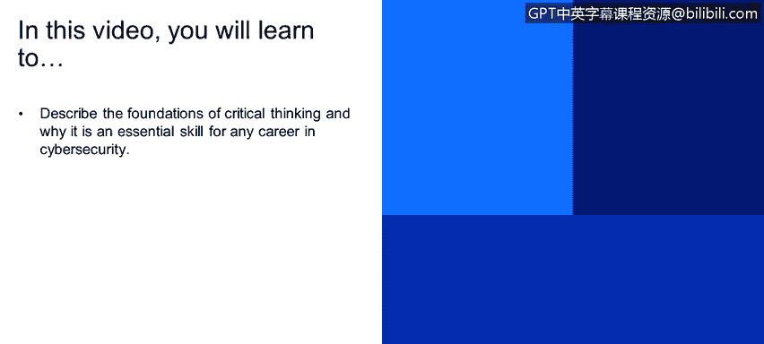
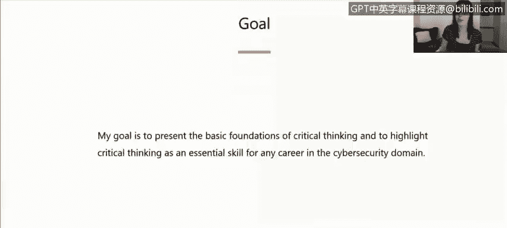
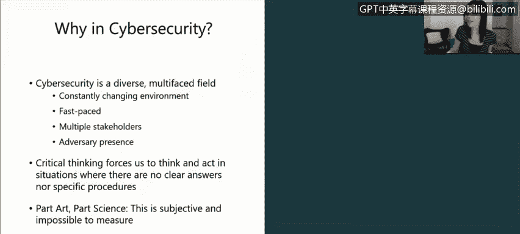

# IBM网络安全分析师专业证书课程1：《网络安全工具与网络攻击简介课程（IBM）》introduction-cybersecurity-cyber-attacks - P88：14_01_beyond-technology-critical-thinking-in-cybersecurity.en_subtitled - GPT中英字幕课程资源 - BV1c84y1Z7Dp

Yes。In this video， you will learn to describe the foundations of critical thinking and why it is an essential skill for any career in cybersecurity。

So a little bit of background， my name is Kristendal。

 I'm an intelligence developer with Exforce Iris， I've been with IBM for about nine months now and prior to that I was a research at MIT Lincoln Laboratory and this talkBeyond Technology。

 this was a talk that I put together a few months back for a conference here in Boston called Day of Shacur in it。

 it's a conference geared toward women in cybersecurity and what I wanted to do and this was geared toward women who are early on in their career。

So what I wanted to do was highlight critical thinking as an important part of cybersecurity。

 So often when we think of cybersecurity， our immediate thought is it's a very technical field。

 We think our thoughts automatically go to operating systems， not， very technical things。

 And I think that，Our minds our ability to think through problems and think critically through problems is often overlooked and so that's what I'm trying to present with this box so what is critical thinking it's one of those things that doesn't have a hard and fast definitions everybody's got their own definition of what is critical thinking and I went through I did some research and I found a few definitions and then I made up my own that I liked that I put at the bottom and so for the purposes of this discussion。

 critical thinking is controlled purposeful thinking directed toward a goal you know it's different than daydreaming it's different than thinking about what you had for breakfast or your to do list it's very controlled purposeful thinking。

And again， my goal with this presentation is to present the basic foundations of critical thinking and also to highlight this as an essential skill for any career in the cybersecurity domain。

 whether you're in finance， whether you're in HR， whether you're legal whether you have a technical role。

 I think you'll take something away from this and you skill to apply。

Regardless of your role or the project that you're on。So why in cybersecurity。

 why am I focusing on critical thinking specifically in cybersecurity beside the fact that I work in cybersecurity。

 there's a number of characteristics of the domain that I think lend itself to you know。

This kind of discussion。 And one is that know it's a constantly changing environment。 you know。

 it's very fast paced。 we've got different technology that's changing you know every day。

 there's multiple stakeholders， you know whether that come from a variety of backgrounds whether that's economic legal HR and we've also got an adversary。

 there's an adversary presence in there， So it's very multifat it's new field too it's a relatively new field and we don't have all the answers。

 know we don't have cyber figured out。 And so critical thinking skills these force us。

To think and act in ways in situations where there are no clear answers and where there are no specific procedures in place。

And again， this is part art part science， there's no defined way to do this， it's subjective。

 it's impossible to measure， but I think it's so important that we talk about it and have these discussions。

And one other point I like to bring up a lot is that we live in this age of Google it where often our knee jerk reaction when we're faced with the problem is to use Google。

 is to enter our question and direct search box and the internet tells us the answer and that's different from the situation in which we had to rely on books and libraries and slower research methods to answer our questions。

 information was not as widely available。And so this wealth of information isn't always good。

 you know， more data doesn't always equal more knowledge and it can quickly start to overwhelm our reasoning abilities and because of this。

Critical thinking is more important now than ever。 the ability to discern important information from a vast sea of information and make educated。

 intelligent decisions。

