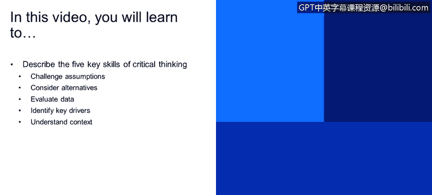

# IBM网络安全分析师专业证书课程1：《网络安全工具与网络攻击简介课程（IBM）》introduction-cybersecurity-cyber-attacks - P90：16_03_critical-thinking-5-key-skills.en_subtitled - GPT中英字幕课程资源 - BV1c84y1Z7Dp

Yes。In this video， you will learn to describe the five key skills of critical thinking。

 challenge assumptions， consider alternatives， evaluate data， identify key drivers。

 understand context。

5 skills。 So now how do you you know practice these skills。

 How do you actually apply these in your everyday life you know on your job。

 how can you grow these and become a better critical think so these skills， these are not my skills。

 These came from a woman that I worked with at a previous job firm and these five skills came out of her。

Time， you know， working， studying psychology and studying， you know how humans。

 you make decisions and so for each of these skills on the next slide。

 what I'm going to do is I'm going to go through each of the skills。

 explain know what they mean provide some additional work that examines you know how can that be applied to cybersecurity and how can you actually exercise this so。

We'll start with challenging our assumptions。 This sounds easy， but it's hard in practice。

 It requires。Questioning your mental model， questioning the mental model that underlies your reasoning。

 How do you do that， Because assumptions oftentimes we're not even aware that we're making them。

 They're based on， you know， our past experiences， thoughts and evidence， our personality。

 So oftentimes we don't even know that we're making an assumption。

 What I found is that it's very useful to bring in other perspectives to talk to other people and start brainstorming and listing out your。

Assumptions and to continually do this。😡，You knowThrough the lifespan of your project。

 throughout the project timeline， question your assumptions， gather more data。

 you know take a systematic you know disciplined approach to this and so what I usually do。

Is I tried to make a framework out of this， I tried to put this into steps that。

 you know kind of distill how you would do this and so step one is you know explicitly list all assumptions and again this requires other people invite all of the stakeholders involved whether you know' a project manager colleagues whoever。

😡，Have a brainstorming session where you start to list like every possible assumption you could be having。

 and then for each of those assumptions， question them， examine them with some key questions。

 you know why do I think this is correct， When could this be untrue。😡。

How confident am I that that's valid， What's my confidence level， and if it's invalid。

 what would the impact？😡，YouThis gives you a way to start to triage your assumptions and then now you can categorize them based on evidence。

 you know， is it a solid and well supported assumption， is it correct as caveats， you know。

 or is it unsupported or questionable？😡，Unsupported and questionable doesn't necessarily mean wrong。

 it just means you need more data and so after you go through this categorization。

 you refine you remove， you collect additional data as needed and you iterate over this you know this happens naturally throughout the lifespan of your project and so that is your key assumptions check。

Number two， so now we've checked our assumptions。Are there alternative explanations。

 Are there alternative explanations for behavior for an activity？Like I said。

 our brain can piece together a situation with just a few bits of data。

 but the scary thing is that you know if we fail to consider missing data or alternative。

 you know this can lead us down the wrong path we have to be able to consider alternative explanations avoid letting yourself become entrenched in one explanation。

 I can't tell you how many times this has happened to me where we become so engrossed in one explanation it turns out to be wrong because I fail to consider alternative explanations and so again how do you do this？

Frainstorming， get more people in the room， start， you know you need those different perspectives because you need different perspectives of looking at the problem and different creative thought processes。

I like to use the six classic journalist questions as a framework for this which I'll talk about on the next slide to evaluate all different dimensions and then also consider the null hypothesis。

 this is the exact opposite of what your main hypothesis is and this is a good exercise because sometimes it forces you to look at a problem from a different perspective。

😊，So。😊，The6 W， again， they're very simple。 You know， we all know these， who， what， where， when， why。

 how， And I find that they're。Very useful for you know examining explanations or examining you know these alternative explanations。

 so you know in the case of well I like to use a threat hunt example， who is involved， you know。

 who is the victim， who is the target， who are the stakeholders。

 whos affected you by the outcome of this。What is at stake， whether it's data。

 whether it's a physical asset， what happened， you know， what is the problem。

 what's the desired outcome of this？😡，Where did this take place， does geography matter。

 where is the infrastructure， where is the victim， where is the adversary。

 does this matter and again， when does timing matter。

 are there key dates are there deadlines that we need to be aware of， and why are we doing this。

 ask yourself that make sure you're solving the right problem you know also what are the key drivers。

 what could be a motive。😡，And how， how are we approaching this。

 is it feasible and then be detailed and specific， really think through you know how you're going to think through each alternative and what that would entail and whether that's plausible。

😡，So， again。Examine alternatives explanations。Look at them through the lens of these six different questions look to characterize each explanation and examine it from different dimensions。

So we've identified our assumptions， we've evaluated alternative explanations。

 now we get to evaluate our data。 this is one of my favorite skills。

 this is the crux of the scientific method assess the data against multiple hypotheses to see how well it fits if you've got a favorite hypo but the data doesn't fit then you unfortunatelyly have to let go of that hypothesis and there's a few there's a couple of points I like to make on this slide that aren't necessarily related directly to critical thinking but I still think are very important to make in the first I'm going start on the bottom the first is that cyber data is notoriously hard to get and oftentimes people don't realize that until they need the data and this can be for a number of reasons whether it's policy privacy issues you know maybe HIPAA GDPR maybe there are reasons that you know your customer or your client or。

hoever you can't get the data it could be that it's not been collected you know if your network is not instrumented to collect certain data or your host systems aren't instrumented to collect certain logs。

 the data doesn't exist and then you can't do anything So what I like to tell people is to be proactive be proactive when you're setting up a new network environment。

 a a new system， establish a baseline for what's normal。

 understand you know what's important on your network in what data you would need to capture in order to you know triage problems or to you know monitor its health and wellness and so the nice thing about this too is that it helps you establish a baseline for what's normal helps you to see you know what is normal source and destination web traffic look like what does normal end point activity look like。

This allows you to you know this is key to not anomaly detection。

 this is how you'll be on the lookout too for inconsistent data。

 so again evaluating data if the data is not there， it's not there， be proactive。

 be proactive in establishing good data collection practices。🤧And skill number four。

 so identifying key drivers。So。Again， key drivers or are things that can significantly impact a situation and they're not always technical in nature。

 so think about things if you're you know in from a cybersecur perspective these obviously do include technology。

 so encryption， authentication tools， framework， infrastructure availability。

 but they also include things like regulatory and political drivers， so privacy， GDPR。

 safety regulations， you know， intellectual property。Supply chain logistics issues， their employee。

 employees themselves， you know their training needs， their perspectives， their skills。

 and then your threat actors you know we always have that adversary that other person you know what are their technical capabilities。

 what are their motives， what are their opportunities so a nation state threat actor is going to have a lot more you know financial capability and perhaps different motive than a script kitty or somebody who's know hacking at your server from their from a basement somewhere so they're different。

A number of different drivers that can impact your situation that it's important to be aware of。

 because they're not always technical。🤧And number five， understanding context。

 so what does this mean context？is the operational environment in which you are working。

 and so the context here at IBM is different than the context at a university。

 which is different than a context。Perhaps that。Oh。Another。

 you know at a Microsoft or another company and so context manners。

 be aware of you know different perspectives of your managers， your colleagues， your clients。

 ask yourself these questions， you know what do they need for me， how can I frame the issue？

🤧Do I need to place their questions in a broader context and this is where the notion of framing techniques comes into place and you recall at the beginning of the presentation when I outlined the goal of this talk and also what I mean by critical thinking that was a framing technique to ensure that we are all on the same page and to understand that we are all using the same vocabulary you know because this helps keep this helps to avoid confusion and avoid problems down the line。

 so I love framing techniques as。Just a solution to mitigate problems down the line。

So framing the issue， again， there's a number of steps。

That you can do to help you look at an issue or a situation more objectively。

 and the first is to identify the key components inherent in know whatever the situation is。

So what does this mean， who are what are the key components。

 you break them down into component parts and start listing your key actors key categories。

 and then from there start to identify the different factors at play you understand the components。

 what are the driving forces and again this will allow you going back to that driving forces diagram to start revealing additional insights and relationships that you might not have been aware of initially。

Now you can start to look at relationships well patterns and relationships exist among different components and factors。

 are they static， are they dynamic in the case of you know maybe doing a threat hunt investigation。

 often graphing databases or may help here to help start to visualize different relationships among entities。

In similarities and differences， are there historical analogies that you could fall back on。

 have you seen similar patterns， behaviors or a situation in a different context or a different experience？

Can you pull from that？And then redefining experiment with different ways to reframe your problem。

 you know write down what you know what you don't know， how can you look at it differently。

 is there a root cause perhaps that you're not seeing。😡，And so。Going back to our elevator problem。

Again just to remind us that we're managers of a high rise apartment complex you know people are complaining that the elevators are too slow and we've got a number of different approaches to fixing this problem you know i'm sure all of you came up with your own approach you their own thought process this is a real。

Anecdodote， this is a real situation that happened and what they ended up doing was installing mirrors。

 they installed mirrors and the complaints died， all of the semi elevators were faster。嗯。

And this is a classic example of problem framing and how you can by changing the problem。

Problem space， now fundamentally changing the solution space by installing mirrors。

 the problem wasn't that the elevator was too slow。

 the real problem that people are complaining about was that waiting is boring it was boring to stand there and wait because you know that their minds weren't focused。

 they were focused on the waiting by installing mirror。

 now all of a sudden people who are waiting for the elevator are distracted。

 they can look at themselves， they can look at other people you know they're not focused on the elevator。

 so rather than making the elevator faster， the solution space is transferred into to shorten the perceived wait time and that can be done a lot more simply and cheaply by putting up mirrors。

 playing music， installing our displays。Things like that。

 So this is an example of this notion of problem framing and how identifying these different aspects of a problem to deliver like these radical improvements。

In start solutions to a seeminglyly intractable problem。And again。

 this is why having that diversity of perception of thought within cybersecurity is so important。

So again， just to recap the five skills that you know I've outlined here， challenge your assumptions。

 refine as you learn more， consider alternative explanations。

 don't get entrenched in one explanation， evaluate data， again， does the data fit your hypothesis。

Identify the key drivers。 What are the driving forces at play remembering that they're not always technical。

 they might be political。 There might be know personnel issues。

 There could be a number of driving forces and understand the context。

 understand the context in which you are working， Can you put yourself in other people shoot Can you reframe the problem so that the solution space is different。

