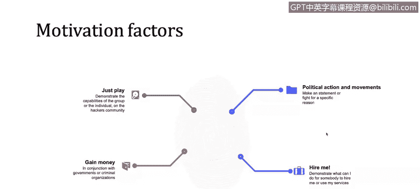

# IBM网络安全分析师专业证书课程1：《网络安全工具与网络攻击简介课程（IBM）》introduction-cybersecurity-cyber-attacks - P92：18_01_a-brief-overview-of-types-of-actors-and-their-motives.en_subtitled - GPT中英字幕课程资源 - BV1c84y1Z7Dp

Yes。In this video， you will learn to describe who the primary actors are in cyber crime and their motives。

So let's take a quick look into the type of thectors and their motive in order to perform cybercr or hacking into technology systems。

There is a lot of actors， but we could summarize four of them。 First of all， we have the hackers。

 Those hackers could be paid or not。 For example， private organizations could pay a group of hackers to hack a company and structure their database for。

 I don't know。 to obtain。Intellectual property， for example。 And actually。

 that's happened in the past。 There is something called the operation Aurora that I will recommend some further reading regarding that operation。

Then we have internal users。 these could be something that is perform intentional or not， I mean。

 if you are working in your company and you try or you forward set of confidential documents into your personal email just for go to your home and start working on the night on those documents。

 that's something that is not necessarily intentional or is not an effect from a intentional perspective but。

It's an attack。 I mean， you shouldn't forward。Or you shouldn't use confidential documents upside your secure company network。

 you are not aware of that and that's probably because you don't have the training。

 you don't have the administrative control， that policy or that procedure that will let you know that you shouldn't done that。

 but that's the difference between the internal user with intentional motive or not， for example。

 if you go to your company and you intentionally go and plugs a USB drive into your computer and execute a bid。

 that's something intentional， but the thing is sometimes it's a little bit difficult to understand if the user。

 if internal user have the motive or not to perform those malicious actions sorry。

Then we have hackivism， hackivism is something similar that the hackers。

 but the thing with hackivism is normally nobody pays to those hackivism to perform attacks。

 for example， DD campaigns are performed to a lot of states。

 a lot of nations in order to make pressure for one particular decision， for example。

 we're going to explore a couple of Singapore at hacks that a group of hackivisms perform on the government。

Websites。Because the Singapore government are implementing new compliance and new regulations into the Internet。

 So that's a quick example of the activism。And governments， we talked before about governments。

 their intention， their intentions， mostly their intentions are not financial， but。

They have intentions。 They normally wants to aspire。

 They normally wants to understand what's happening in each country from the inside from the confidential data that they are managing。

 So that's another actor。And what are their motive。

 here's just a quick example of the motives or some motivation that the attackers may have。

 one motivation is just play， demonstrate that they have the capacity。

 They have the capabilities for hack into a secure system。 They sometimes try to gain money。

 They try to make some money on their scams or on their hacks。

 That's something that could be categorized or could be aligned with criminal organizations。

Political and political action political political actions and movement a movement， sorry。

 if a group of people wants to perform and attack into a government。In most of the occasion， that。

Attack claims because they have a motivation。 They have a political motivation。

 They have a movement to make it clear to the government that they are here。 They want something。

 They are not agree with some policy or something like that。

 So there is a political motivation over there。 One interesting motivation is hire me is I will demonstrate you that I could hack you。

 I could enter into your security system。 I could find holes into your security system in order for you to understand that I am good。

 that I am a good professional。 Well， I could。Hacker。

 a good technician or a good guy with technical skills that could be higher into your organization。

 into your government to fix or to patch those security holes。

