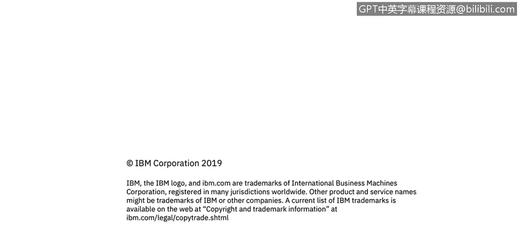

# IBM网络安全分析师专业证书课程1：《网络安全工具与网络攻击简介课程（IBM）》introduction-cybersecurity-cyber-attacks - P95：21_01_security-attack-definition.en_subtitled - GPT中英字幕课程资源 - BV1c84y1Z7Dp

Yes。In this video you will learn to describe the various attack classifications such as passive attacks and active attacks so let's move into security attacks。

 so let's move into attack classifications one of the first attack classifications that we'll look at is the idea of a passive attack。

Essentially， it's an eavesdropping style of attack。譬。Mnology is there capital。A tap。

 a communications connection to the channel that we described earlier in module1。

 and here in the diagram we see Bob communicating with Alice。And an intruder， in this case is Darth。

Cappttures the message out of the communications channel and is communicate this is undetected by Alice or Bob。

 So the benefits of this attack， obviously， since it's not detected by Alice or Bob is a。

The eropping could occur。For a long time， for a very long time。

Right and so we can actually get the content of the messages。

 right second class of attack for passive attacks is traffic analysis。This is a。

An attack a style that doesn't look so much at the payload。

 but the frequency and the size of the messages， one of the great。

Examples of this is during an earlier presidential administration。

 a local newspaper was monitoring the number of pizzas that were delivered after 7 pm。

To the White House and the correlation was between a large number of pizzas being correlated。

 being delivered。After 7 pm and events of a national security nature occurring the next day。

 so this is actually traffic analysis in its most basic form， very。

 very novel way to do that so one of the questions that you'll see here on the slide is do you think passive attacks are hard or easy to detect？

Well， they're hard to detect because the message from Bob to Alice。Meetets our security criteria。

 so what do I mean by that？That the messages are authenticated， so Alice can prove。

That the message is， in fact from Bob。The message can be pass and integrity each other。

Because Darth or interceptor is only collecting the messages， he's not changing them。

So there's no evidence that the message has been changed。We see， you know。

 certainly examples of proving that when Bob says to Alice。

 let's go to lunch at one and both of them show up at lunch at one and consequently there's no evidence that that message has been。

Modified the。Confidentiality of that， of course， is violateating because our intercept or Darth now has access to the。

Message， now whether it's encrypted or not， like I said， that's another question， but Alice。

Won't have any evidences that Darth has a copy of the message。 So， in fact。

 it actually passes that context。 So you can see the perspective of how passive attacks are some of the most dangerous from an。

Information or an intelligence collection process。That can run literally for years before it's been detected。

Active tax。Active attacks obviously involve some modification of the data stream or the creation of a false string。

And can actually fall into four basic categories。Masquerade， replay， modification of the messages。

 and denial of service。So masquerraade。Is intuitive， right。

 This is the masking of one one entity appearing as another。 So in this case， right， Darth。

Would pretend to be Bob。He would intercept the message， read it。

Let's go to lunch at one if that was the message。Send the message to Alice。 Oh。

 how about 1130 is that better， Alice thinks it's Bob reports to lunch at 11。

So that masquerading extremely dangerous within this context。We talked about。

The replay of these messages。So this can be used for a man in the middle attacks so that Darth would intercept the message。

From Bob， read it。Back on that。And then send the unmodified message。Two hours。

 let's say an hour later。With the correct timestamp。

So that Alice receives the message and then acts on it and it passes the integrity perspective because the message is not modified。

Fils the confidentiality because dark has seen out， the integrity passes messages isn are modified。

The authentication part fails， however， because this actually came from dark， not Bob。

 no way to prove that。So modification， all right that this we talked about that a little bit earlier that the message from Darth could be let's meet lunch at 1130 so that message could be。

Actively modified once again， this is of great concern to the US government that messages are modified。

 reports are modified。Significant effort to ensure the integrity of that。

 and then fundamentally the last one， of course， is the denial of service where the message actually just never gets through。

So active attacks， right， are the opposite in terms of characteristics of passive attacks。

Passible attacks are difficult。To detect。However， active attacks have measures that are available that we can actually get a sense that something that there's an enomaal。

It's difficult to prevent active attacks。Universally， absolutely。

 because of the diversity of the style of attacks that come through with。So， that's a。

So the goal here right is to detect the act of attacks early。

And to recover from any disruption or delays caused by the attacks。

 so two major attack classifications。Passive attacks and active attacks。

