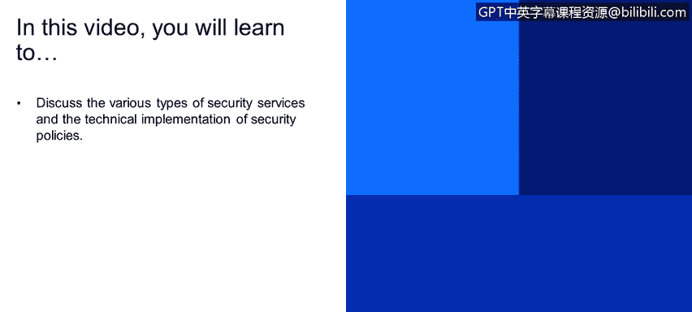
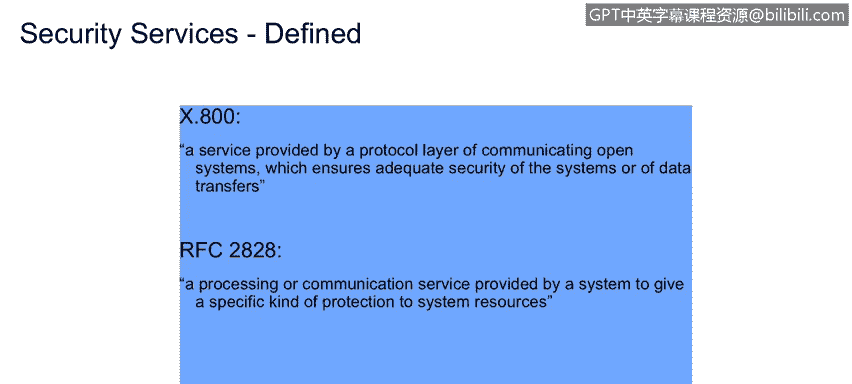

# IBM网络安全分析师专业证书课程1：《网络安全工具与网络攻击简介课程（IBM）》introduction-cybersecurity-cyber-attacks - P96：22_02_security-services.en_subtitled - GPT中英字幕课程资源 - BV1c84y1Z7Dp

Yes。In this video， you will learn to discuss the various types of security services and the technical implementation of security policies。

And look at some security services in terms of security artrcs jump into the definition of security services。

 by the way， this security services ammy's attack classifications come from a great textbook called Network SecurityEssentials applicationp and Standard written by William Stalin considered to be one of the Classic Books and Security repertoire so certainly would think that a sufficiently advanced。

Security professional would have this textbook on their shelf。So we' talk about security services。

 right so a service。Is a processing or communication service rate that's provided by a system。

 this would be the enterprise， the IT infrastructure。

It's designed to give a specific kind of protection to a system resource。

Security services are technical implementation of security policies。

 We talked about access control in an earlier module with that and the security services。

That implement the security policies。Are implemented by the security mechanism。So in this context。

 the security mechanisms are the security enforcement points that we talked about in Mo1。

The security service。Enhancing the security of data processing systems and information transfers of an organization。

So there's some nuances here， right， so we're going to improve using security services。不。

Business process of the enterprise。And we're going to protect。The movement of information。

Of an organization， so that means internal movement。Database to server means external movement。

 for example， to a business department。Purpose of security infrastructure is to be。Provide。

Defensive mechanisms against a security attack。 So obviously。

 security services are designed to enhance。Our ability to counter the security attacks that are presented against the enterprise。

Security services。Can engage and it's a one to many relationship between a service and a security enforcement point。

 this makes sense that a implementation of a technical policy can engage more than one element of a security enforcement。

So often replicates。Cappabilities in。The real world。So we think about how information moves securely。

We've got signatures and dates protection from disclosure， that's why we put things in an envelope。

We make sure they're not going to be disruptive destroyed or modified。

 we can provide authenticity through notarization or witness signatures。Plus， the non repudiation。

Part of that can be accomplished from notarization or。License。

Take a look at a couple of definitions and he's pulled out one from ITU。

 right the International Telecommunications Union， that's the United Nations。

Governing Modi for standards worldwide。Ex 800。A service provided by a protocol layer。

Of communicating open systems， which ensures the adequate security of the systems or of data transfers。

So。This means we think about the OSI protocol stack right runs from applications to presentation sessions through the network。

Transfer protocols down to the physical part of that。

That these layers right communicate with similar layers that's communicating to open systems。

Right in another enterprise or another part of the enterprise and protects the information both of the receiver。

The transmitter。And the communication transfer would say that。Now， kind of legalese， write。

 this request for comment 28- 28， another standard document that's maintained by the ITU。

 a processing or communication service provided by a system to give a specific kind of protection to system resources。

 more clear to be sure。So once again， that 28，28 a little more clear， right？

Talks about implemented the services that are permitted implemented by the security enforcement point。

 Those are the specific kinds of protections and the implementation of the security policies。

So let's dive into some definitions of some specific security services as found in the ExOC 800。

Document now， remember， we had talked about this a little bit earlier。

 that Exdo 800 is an artifact of the ITU， the Internationalcom Telecommunications Union。

 which is not a workerser union， right， It is a an association chartered and staffed by the United Nations to provide international standards for。

Computer and network communications， fairly solid document。

So Stalings talks about five security service categories and the 14 specific services。

That are in there so highlighted with these six elements right here。

's various there's classic security services which are traditionally discussed then notice that these things are written at a very high level like to think about them written at the level of the US Constitution。

Subject to。Legal interpretation， so the top one right is authentication is concerned with assuring that a communication is authentic in fact it。

It's， it's。Correct from Alice to Bob and that it is measurable。啊。

There's a sub version of this called peerer Enity authentication。

 which provides corroboration of the identity。Of a peer in an association。

 so that means Bob and Alice can authenticate each other， so Alice sends a message to Bob。

And along with that goes， hi Bob， I'm mals。And Bob can read the message and say， yes， in fact。

 you are Alice， that is pure entity authentication。Data origin。

 right is a corroboration of the source of the of the data so that Bob can actually look at the message and say。

 yeah， so。Alice actually sent that so we can authenticate Alice and authenticate that the message had come from Alice。

 you can see those two powerful， powerful points。哦。The end of the authentication side。

 so access control moving down the list。Right is the ability to limit and control access to host systems and applications。

Via communication link， so this means in our context， right computer networks not。

Front doors to houses and such。That。The correct individuals are identified。They are。Authenticated。

 right that their identification assertions are validate。And then they're authorized。

 so the three steps for access control， hi， I'm John。Yes， you are， John。Mentification。

Authentication is the affirmation。Of identification。And then the authorization is。

 and you are approved， John， to do the following tweet。So that is a role based access control model。

 there's volumes of content that's thought on the internet and within IBM about how to implement an R back or role based access control system。

So the third element data confidentiality， ensures that the messages are received as sent。

With no duplication， insertion。Modification， reordering， replay or loss。So the lost part of that。

 right？Is that the message is not destroyed。Reordering right so that if the messages are describing a sequence of events that they come in the correct sequence。

 there could be a lot of disruption if those， in fact。

 are are changed in that modification side that the pay that the payload of the message is changed。

 This is the example of let's not meet at 1 PM for lunch， but let's meet at 11th。Insertion。

 no new modifications and duplication that we're not sending duplicate messages to confuse。

Alice Orwell。So the non repudiation phase of this， right， is that the。

Both Alice and Bob in a message transaction。Can't deny。That the transaction occurred。

We talked about this a little earlier about message transmission。Alice sends Bob a message。

Alice can prove that Alice was sent the message， and Bob received it。

Bob can prove that Al sent the message and he received it， so there's no ambiguity area on。

Not being able to authenticate。A transaction it's extremely important within financial services。

Both for banking and for insurance that we need to be able to。Remove any capability of saying。

 I didn't do that。Right， so identification。Authentation， confidentiality。

 all of that's in play with that。 and we talked about availability a little bit earlier on this。

That the resource is accessible and usable， so we talked about the availability， right。

 that the capability， the service capability being provided by the enterprise is available that it's there and that it responds in a timely manner。

Because if you know you can think that if you put a response in and。

You got the response do the next day， that's not timely law。

 so that is part of the availability part。