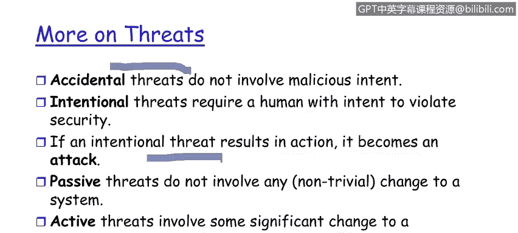

# IBM网络安全分析师专业证书课程1：《网络安全工具与网络攻击简介课程（IBM）》introduction-cybersecurity-cyber-attacks - P99：25_05_organizational-threats.en_subtitled - GPT中英字幕课程资源 - BV1c84y1Z7Dp

Yes。In this video， you will learn to describe how the destruction， corruption， modification， theft。

 removal， loss， or disclosure of information or other resources。

 and the interruption of service can constitute threats to the security of data or systems。

 but the threats， the sources that this can come from。

So the threatstore data communication system， that's our enterprise include these。F elements right。

 the destruction or information of and or other resources。Think about denial of service。

 This is the predominant。Threat to large scale information processing enterprises。

So the destruction of information， by the way， also the destruction of our security enforcement points。

Modification， we talked about the integrity side of that。

 being able to modify a message in flight between Alice and Bob is a significant risk。Most people。

 including the government side， worry more about the modification。Then the corruption of that。

 the corruption can be detected， modification， not so much。

 although we'll show you a mechanism a little later how to detect if a message has been modified。

 but we think about those passive attacks。Where。Systems where the intruders listen and record the messages and transition into an active attack where a very slight modification of a message is executed。

 Very， very dangerous can occur for a long time before people row。So the targets， right。

 are primarily the theft。Of let's use the term critical information。

 these are the credit card numbers， the goals of the attack。

It also may be confidential or classified information on a defense network。

 right is the theft and removal of that。So the disclosure of this information Now this is sort of interesting from a perspective of confidentiality。

 so are the Wikiileaks documents which have been released much to the government's angst over the last year。

 a disclosure of information。They absolutely are， is that a threat to an IT enterprise？Yes。

So I believe that the wki elites。Ecosphere is actually a confidentiality violation and of course。

We also talk about the interruption of services， this is the availability side remember we talked earlier in module one。

That we've got not only an availability parameter that a service is capable， right， I mean。

 is available， but we also need to worry about the time limits。

That if we submit a response to a message and are expecting a response back。

 that it occur within a timely period。So on thefts here。Excuse me， threats。

So threats can really be of two classes， so one obviously is the accidental。

This is one without lack of criminal intentt。The other is intentional threats where there's an intention to violate a security policy。

Now， from the security protection perspective。We do not care between the two of。

Whether an individual， a privileged user， has an oops moment。

Or intentionally violates a security policy that impacts the enterprise。

 the results exactly the same。So we do not differentiate much between these two now we'll create use cases that will help articulate our architecture。

 but the result from the result side， we don't differentiate much between those two。

 so be aware of the differentiation between accidental。And intentional threats。So， from。

Whether this is to be honest， whether this is an intentional or an unintentional result is that if there's a response。

 there's an action by the enterprise。Data moves out。Privileges are reduced。 Some change in the state。

Of the security ecosphere that qualifies as an attack。

 So this is where we've moved from a vulnerability where something could happen。The threat。

To an attack or an exploit where something has happened。 That's the transition right there so。

We worry about。Vulnerabilities， what could happen we react to exploits what。Has happened。Once again。

 here's the differentiation between passive and active， passive， extremely dangerous， long term。

Presence on the network。Untected by Alicewls， Bob or any other user。我 of我。

Architecture slides speaks to an industry average of exploits， attacks。

Being passively on the network for 284 days before detection。So one of the like I said。

 difference between passive and active， there is a change to the state。Of the security epher。

