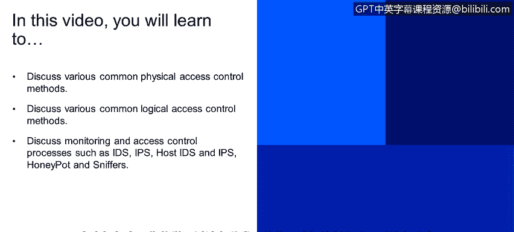
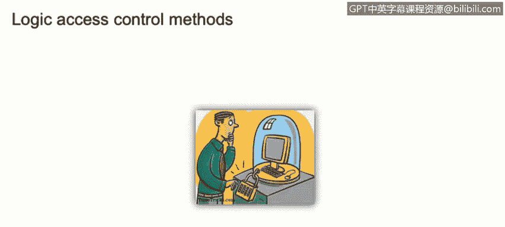
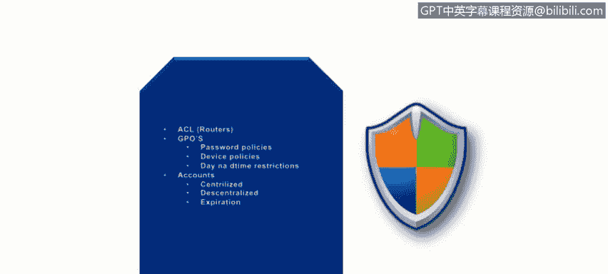
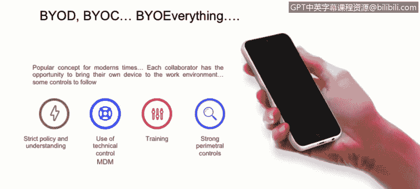
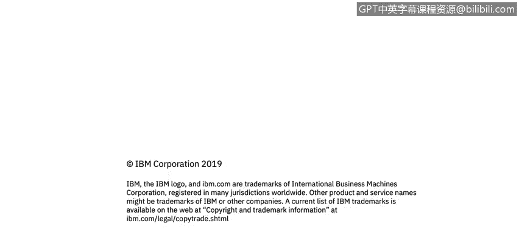

# IBM网络安全分析师专业证书课程2：《网络安全角色、流程与操作系统安全》roles-processes-operating-system-security - P18：17_物理和逻辑访问控制.zh - GPT中英字幕课程资源 - BV1G44y1F7oo

In this video you will learn to discuss various common physical access control methods。

 discuss various common logical access control methods。

 and discuss monitoring and access controls processes such as IDS， IPS， host IDS and IPS。

 Honeypots and Snis。

We're going to go to access control methods this time we're going to focus on physicals。

Phyical access control might go to perimedal， which could be a fence to buildings， to work areas。

And service and networks we usually on the enterprise type of scenario for service and networks。

 we have a guest network， we have an enterprise network for work areas are the work areas that only authorize personnel can access to it for buildings。

 also it's kind of a physical access control which should be having the separation of the people who can access that building and then perimedals things as fence is a great example for this are like to give are the embassy in different countries。

They usually keep out really well or they actually do this really really， really well。

As per technical control or technical uses of the physical controls， what do we use。

 how do we accomplish it， we can use cameras in order to monitor who is going in and out of a prominent an area。

 we can use traps or man traps， these are the doors that you actually need to pass a batch and it will actually just let one person go through。

We can use tokens so we can use listen logs in order to keep track of who our persons are going in and out of that。

Groommen specifically。LogicLog access control methods。 We spoke a little bit of the physical。

 Now let's speak of the logic access controls on here。

 it touch a little bit of the topic of ACL or routers。

We can have a。Roole in order to keep one of each one of other。Resources that we want to use。

 if we want to limit to the access on here， we can do it by an Afield rule。

We have a GPO or goA policies or compliance solutions。We can enforcing their password policies。

 device policies， day and time restrictions。For example， if you shouldn't be seen。

A resource connecting to a VP network to access our。Enter by server at 2 AM Eastern time。

 It's not our usual。Business， so that is something that we can actually limit。

Also something that we can have that access control， it's for the accounts。

 we can have a centralralized decentralized and actually enforce the expressionir of those accounts。

 This all goes or circles back to the best practices that we got earlier on the curve。

So byYuD， ByUC， BYU， everything， it's a public concept being thrown out there。

In order to enforce it with access control， it takes a lot of effort。

 We need a strict policy and understanding of the things that we're going to do。

 We need technical controls for MDm。 We need training in order to have our resources properly trained to use those。

 bring your own device， bring our computer， bring your own cell phone， so。

This also requires a strong peri controls for us。

So it takes a a lot of effort。 Here's a little bit of a chart that was share with us。

 We can see that a 40% of our data breach are associated with the bioD。

 this point of where are or the enterprises are pushing a little bit or pushing more into BY D bring your devices。

 but they are not doing the same thing with their security policies。 So on here。

 we can see a little bit of the。The charts that are。When we share it。

So monitoring the access control process now that we have reviewed threats and vulnerabilities that can cause damage to the organization。

 let's talk about the devices and techniques that can secure our hosts。

The first thing that we're going to mention here is IDS or in detection systems。

An IDS is a system that scan evaluate and monitor the computer infrastructure for signs of an attacking progress。

It requires hardware sensors and soap in order to have the proper deployment on the environment。

 it's important to keep in mind that each implementation is unique and it depends on the organization's security needs。

Also always remember than an idea that it only notifies you all the attack。

Then we have our IPS or inition Per systems， and IPS has the monitoring capabilities of the ID that we just mentioned。

 but it can actually block detected threats and still continue to use a passive response for other incidents。

Then we have our house I and IPS， these our house based system that can monitor the house for unexpected behavior or drastic changes under their baseline。

For example， it may include file integrity checks or to look for any outbound request that could be a little bit suspicious。

 for example， using the trade intelligenceligence Is。

 looking for those album connections either on IPS and I， if we wanted to kill that connection。

 we would use the IPS in that matter。Then we're going to mention the honeypot。

 honeypots it's a security tool to lure attackers away from the action network where they can be monitored safely while the attacker is on the honeypot。

 all the traffic and techniques are being locked to be reviewed。

Honeypots can be software emulation programs， they can be hardware decos or entire domain networks which are also known as Honets。

Then lastly， we have our sniffers are also known as packet analyzers。

 it's a device program that can monitor the network communications either on the wire or the wireless network。

And they capture that data those are commonlyunal use while troubleshooting networks something before we finish on this slide that I want to leave really clear it's a difference between an IPS and I please keep always keeping mind that an I it's something that we can kill the connection or take action upon as we can see on the image presented to the right see adding number two。

 the one below we see the attackger going attempting to go to the target。

 but when the IPS takes that connection actually kills that connection。

inside of on the ID we and only let you know that the attacker is actually trying to go to that target。

So that will be everything for the monitoring access control process。

