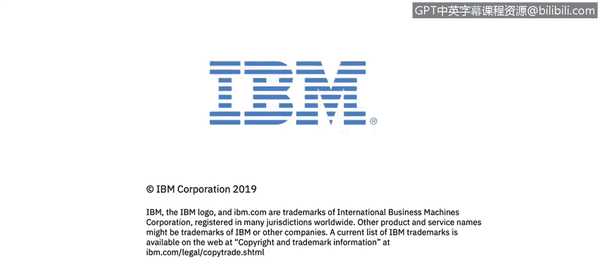

# IBM网络安全分析师专业证书课程2：《网络安全角色、流程与操作系统安全》roles-processes-operating-system-security - P20：19_操作系统基础欢迎.zh - GPT中英字幕课程资源 - BV1G44y1F7oo

In modules 4，5 and 6， Warren Perez， an S IEM administrator for IBM's managedage Security Services Organization in Costa Rica。

 will give you an overview of the architecture， basic commands and file systems for Linux。

You'll also study the Mac OS and Windows operating systems to prepare you to navigate through system threats on the desktop。

You'll investigate operating system commands and specific system resources using the PennT Monkey referenceer site。

Pen test Monkey is one of the many tools you can use as a cybersecurity professional。

Shall we continue？

