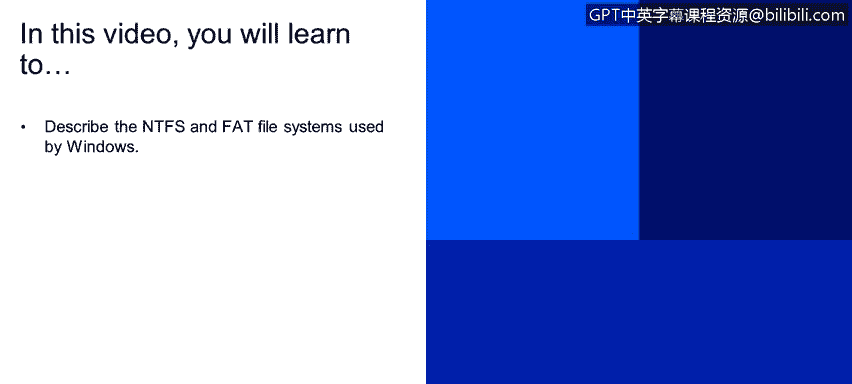
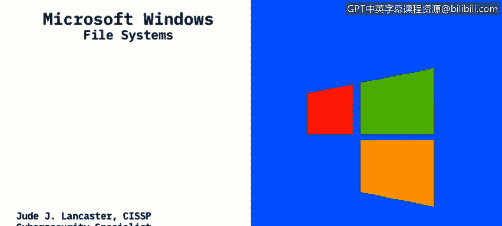

# IBM网络安全分析师专业证书课程2：《网络安全角色、流程与操作系统安全》roles-processes-operating-system-security - P22：21_文件系统.zh - GPT中英字幕课程资源 - BV1G44y1F7oo

In this video you will learn to describe the NtFS and fat file systems used by Windows Okay so let's talk about the different file systems that are prevalent within Windows and a file system is what enables applications through store and receive files on storage devices when we're talking about storage devices in windows we're mostly talking about a hard drive so what's installed in your computer it could be a spinning platter。

 which is a mechanical device or it could be a SSD a solid state drive。

 which is a non-mechanical device that stores that data files are placed in what we call hierarchical structure so you may have folders within folders within folders and the file system will specify naming conventions for files and the format for specifying the path to a file in that hierarchical or tree structure just for definition's sake。

 a file is a unit of data in the file system that a user can access or。

So a picture file is one file it might be a JPG or it might be a PNG file。

 but that's what we consider is a file and every file has to have a unique name in its own directory What you'll notice is if you copy a file within a directory and paste it in the same directory it will put a number behind that file name just to。

Show that it's the same file just a different copy of it and a directory and you maybe used to be having it be called a folder within Windows is a hierarchical collection of directories and files and we'll talk a little bit more about that as we go on so there are really a couple different types of file systems that are used within Windows NFS or new technology file systems is the one that is most prevalent today on operating systems like Windows can serverver 2012 and 2016 those are that MTFS is what most of your drives will be formatted。

NTFS has been around since 1993 and as I said it's really the most common file system for Windows。

 both end user systems as well as servers that are running Windows will run the NFS。File system。

There's also another kind of operating system that was really previous to MTFS which is called file allocation table or fat It's a more simple file system that's been really used since the 80s and you may see different numbers associated with that fat operating system or excuse me that fat file system and those numbers that proceed the fat or file allocation terminology refer to the number of bits used to enumerate a file system block so 16 or fat 32 mostly where you will see file allocation table file system is on removable drive so if you have a USB drive or even a CD drive that's ridable it would typically be formatted as a fat 32 file system and fat 32 can be used for devices that are less than 32 gigabytes in capacity as we saw hard drives。

Bigger than that， we needed a new type of file system and that's where the NTFS came in and now fat is mostly used for smaller drives and smaller removable storage devices。

