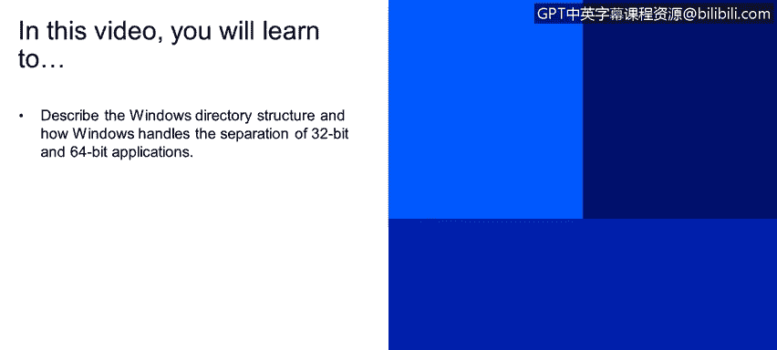
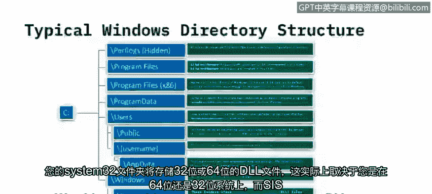
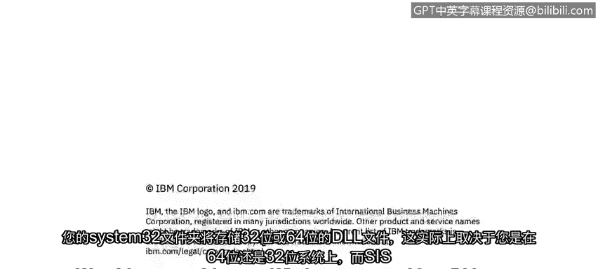

# IBM网络安全分析师专业证书课程2：《网络安全角色、流程与操作系统安全》roles-processes-operating-system-security - P23：22_目录结构.zh - GPT中英字幕课程资源 - BV1G44y1F7oo

In this video you will learn to describe the Windows directory structure and how Windows handles the separation of 32 bit and 64 bit applications So let's look at a typical Windows directory structure and most of you have seen Windows before have probably seen that everything is stored on normally the C driveri I don't know why it was called the C driveri but that's just what we call it so your main hard drive is typically called your C driveri and these are the kind of standard file structure you will see on a Windows 10 device so you'll have some folders that are hidden and when they're hidden that just means that they're not accessible to the end user unless you actually go in and unhide them within the control panel so those are folders that。

Microsof says you know yout really don't need access to those so we're going to hide them from you and the main one that's hidden is called Perf logs and it holds performance logs。

 but typically it doesn't really hold anything it's usually empty but it is a folder that is one of them that's in the in the common directory structure off your C driveri and then you have kind of the meat of what's on the CDri。

 which are your program files and your program files X86 so on newer operating systems that can address more memory we went to a 64 bit operating system。

 some of you may remember that they' when Windows 1 came out it was Windows or excuse Windows 3。

1 was actually a 16 bit operating system and then Windows 95 became a 32 bit operating system and we have various versions that of Windows operating systems。

 both 32 bit and 64 bit operating systems。The real difference between a 32 bit and a 64 bit operating system is the amount of memory that can be addressed as applications came out that needed more memory to run operating systems increase their bit to 64 in order to address additional memory。

 32 bit operating systems can only address 4 gigabytes of memory and for modern applications that's just really not enough so with really with Windows 2000 we started seeing operating systems that were 64 bit and then XP and Windows 7 and then finally with Windows 10 our 64 bit so and the reason I go into that level of detail is because of those two different program files so program files will store your 64 bit applications if you have a 32 bit operating system you won't have a program files that X86 director。

Because all of your。😡，Applications will be installed in the program files directory on a 64 bit edition of Windows or a 64 bit operating system。

 your 32 bit applications will be installed in program files X86。

And 32 applications can run on a 64 bit operating system they are just separated so you'll see where they're installed differently and then you also have a folder called program data and those are files that are access by computer programs regardless of what user is logged into the system so they're really files that the applications that you run need in order to work effectively independent of of any user that might be logged on and then you have your user directory this is where your user profiles are stored and each subfolder will be a different user name so as an example all Windows operating systems will have a public folder so this is where end users might be able to share file so if you have multiple people logging into a system they can put something in public and everyone would have access to that file and then you will have in addition to。

Under the users folder， you will have each username of people who have logged onto that system or I should say who are authorized to log onto that system so user files are typically stored in there you may have lots of folders under the username directory so you would have a documents from my documents folder you'd have a pictures folder a music folder anyone who's seen a modern Windows operating system will have noticed that and then you will also have an app data folder this would be like your program data folder but for application data that is specific to an end user so if you have a custom template within say Microsoft word it would be stored under your username and then the app data folder in order to separate it from other users who may log onto the system。

And then in addition to that you'll have your Windows system directory and this is where Windows is actually installed here。

 and you'll have mainly three folders under that， your system， your system 32 and your cisWow 64。

 these are file or folders that really are the core features of Windows and the Windows API。

 So any kind of program ask Windows to load what we call a dynamic link library file。😡。

And it doesn't specify a path。 These are， These are the folders that are searched。

 So this is where Windows。Sttores all the kind of system files that are needed to run windows and provide the graphical user interface to the end user your system folder stores your 16 bit DLs and really will be empty on 64 bit additions of Windows but the system folder is still there on 64 bit operating system。

 your system 32 will store either 32 bit or 64 bit DLL files and what that really will depend on whether you're on a 64 bit or 32 bit system and then yourWow 64 will only appear on 64 bit versions of Windows and store your 32 bit DLLs and so that's really what you'll see when you open up a common C drive on Windows system either and then user system or a server system are these are the folder structure that you'll commonly see on a monitor。

Those operating systems。

