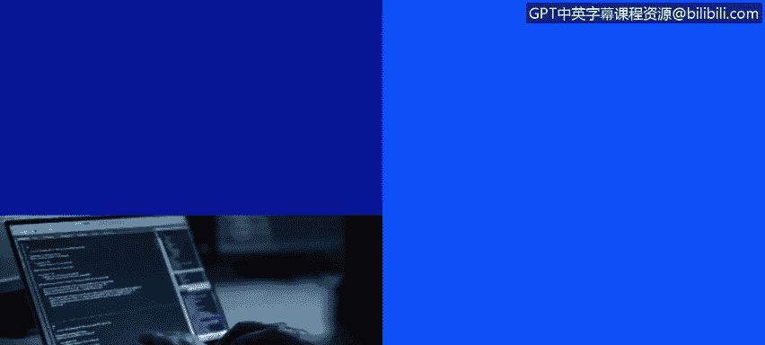
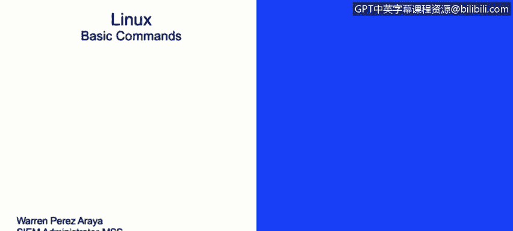
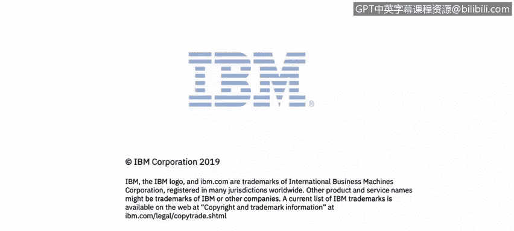

# IBM网络安全分析师专业证书课程2：《网络安全角色、流程与操作系统安全》roles-processes-operating-system-security - P28：27_基本命令.zh - GPT中英字幕课程资源 - BV1G44y1F7oo

In this video you will learn what these useful Linux commands do Now we're going to discuss some basic commands on the Linux operating system。

We have a list of basic commands， and we're going to go one by one。

First of all we have the C or the change directory command。

 This is basically a command use to change the directories of a user。

 these commands are all based on a text mode like CasLI for example， interface。

 so if you want to move from s home to s bin you and use the command CD。The C。

It's the command used to copy files or directories for directory。

 you'll have to use special flags like the Dutch art or recursive。

Since directors have multiple files or directors inside of them。

 you have to use a Cp command together with the flag。

That tells the copy command to do a copy of re course of the inside directories。The move command。

 it's similar to their copy or the Cp command。 But in this instance。

 the M or the move command will move directors。From one place to another place。The LS command。

It used to list information related to files in directly， like owners and privileges， for example。

 and we'll see this in a little bit。The Df command， it used to display file system this space。

 So if you want to know how the parts are doing as regarding this space， we could use the Df command。

 and that will show and prints information related to disk usage。The k command。

It's used to quote toquote， kill or stop an execution process。So if you have an executing process。

 for example， Apache running in the background and you want to stop it。

 You could use the kill command specifically to kill that specific。Process and service。

The RM command。It removes files。Or directories， you will need to specify the recursively or the recursive flag on the at specific command。

 if you wanted to lead directories。The Rm can delete both files and directories。

 but we also have the Rm B， which basically will remove directories。

 but it has to be an empty directory to be able。To be the。We also have the cat come in。

It's short for contacting。You can combine several files into one。

 but it's also very useful if you want to see the content of a file， if you want to， for example。

 cat then text file， it will show you all the information inside that file on in a command line interface。

We'll have the makeg directory command or the N there。It creates a new directory。

 an empty directory gets created。 So basically you will put you type in Mk dear and make De。

 And the name of the directory you want to create。The I conflict。

It's used to view or configure network interfaces。 So whenever you need to。

Check the network configuration of the Linux system。 You can use the I country command。

 and it will print you on the command line interface face the information related to specific network cards or all the network cards install the system。

The locate command is very useful If you want to search for the location of files。

This command uses an internal database that needs to be updated and for updating the databaseverse。

 you will need to use the update D command。The tail command is also used to view the last 10 lines by depot of the text file。

 You could also combine the tail command with minus the dash end。

And you could use tail minus n and then specify the number of lines that you want to see on that specific file。

You could also use the flat dash F。And that will give you a real time view or any file。

 which is very useful if you're reviewing block files， for example。

 do they change constantly So you could use a tail dash F。 And that will pretty much give you a。

A real time view of that specific file。To less command。It's a。

It's a command used to view huge log files。It does not load the full file while opening。

 It just basically loads the file as you move down the file。The more command。

 it's also used to display text， and this does it one screen at a time。 So for example。

 you to you want to scroll through a big file， it will do it one screen at a time。

 So if you scroll down。On a fire， it will scroll down the size of the command interface at a time。

 basically。The nano command， it's a text editor。 It's used to edit files， you could type in commands。

 you could delete information from the file。 It's just basically like a word。

Program for the command line interface。We also have the C mode or the change mode command。

 This is a very useful command used to change the privileges or the permissions on files and directories。

We'll discuss this a little bit further。

