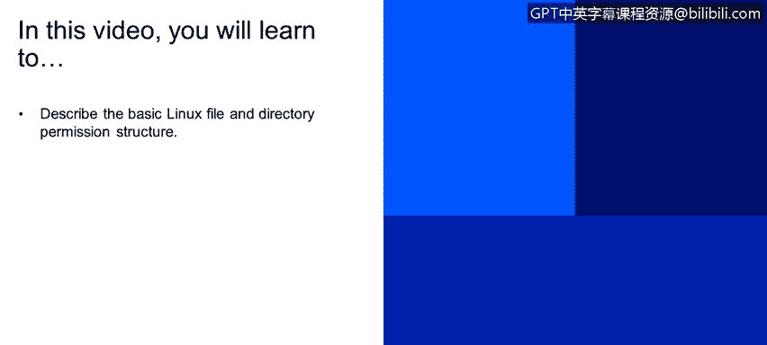
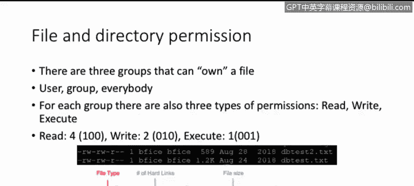
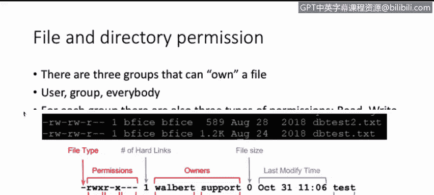
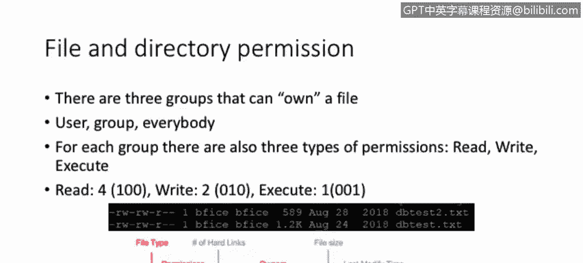
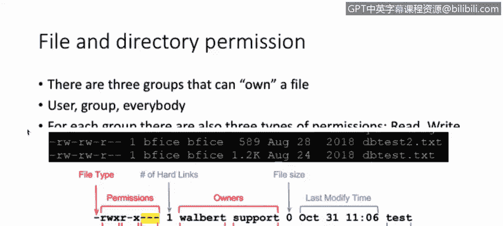

# IBM网络安全分析师专业证书课程2：《网络安全角色、流程与操作系统安全》roles-processes-operating-system-security - P29：28_权限和所有者.zh - GPT中英字幕课程资源 - BV1G44y1F7oo

In this video， you will learn to describe the basic Linux file and directory permission structure。

Now， let's talk about permissions， both for files and directories。And then specifically。

 we have three quotequote groups that can own a file， they are the user。

Basically the owner of the file， the group， it's just like the group that owns the filess as well。

And everybody， that means the rest of the people that can use the file or the rest of the users that are not the user or inside the specific group。

You。Thank your attention to the。To a last image on these specific slide， you will see。

The W Al is the user of that specific file。 Then you have support， which is the。啊。

Their group that owns that file as well。 And those two together the user and the group。

Basically， make up for the owners with that specific file。For each specific group。

 there are also three types of permissions that you can assign with three basic permission types。

 right， for this specific course， we're going to discuss these three basic permissions。

They're the readath， the right and they execute。This permissions have an up value or a number， say 4。

2， and1， but we also can assign binary numbers to these specific files。In this case。

 RE has a value of4 or 100 and binary。Which is for in binary， right has a value of 2， which is 0，1，0。

 is basically 2 in binary。 And execute you have one。Which in binary area is 001。Again。

 if you bring your attention to the last image of this slide you will see on your left。

The file type， which is basically a file that is indicated by a dash。 And then we have permissions。

 We have three sets of permissions， and all of those have three specific permissions。

The first set of three letters， it's for the user。 We can tell from this image the user has。

 readr and execute permissions。On the second set of three letters。

 we can see that the group has only read permission and execute permissions。

 It does not have just I'm sorry， It does not have a right permission。 You can tell that by the dash。

 That means that that specific permission is not allowed in this group。

And for the others or everybody else， we have no provisions at all。

Here are some representations of what we just discussed。

 Theoc value of the permission in zero means no permission。

 One means that you can execute two means that you can write。And you can also add those to。

 for example， if you add the execute permission on the right will give you three meaning right and execute。

You have four， for example， it means that you can read the file。

 you could also use four and one which means that you can read it and write it。

 I mean read isn and execute I'm sorry six means that you can read it and write it seven means that you could pretty much do。

Everything on that specific file， we try and execute。On the right side of the screen。

 you can see another representation of how those issues are added。For the owner permission。

 we have a 7， meaning we have。4 for the read，2 for the right and one for the execute。

 This means that。The big read is once， the right。It's also one。 And they execute。 it's one。

 So we have binary 3，1，1，1，1 that basically translates into a 7。For the group permission。

 we have four， two， and one that adds up to five， meaning we have four for the read。

Two for the right and one for the execute。And since we have on top of the group permissions。

 you see that it has read right and execute。 But the right has a dash。

That means that we do not have that permission set。

 So if you add4 from the region and one from the S key， you will end up having five。

 And that's where that number derives from。On the user permission or the rest of the everybody also called others。

 we only have the read permission and we have a dash on the right and the execute that means we only have a permission of fourth for the rest of the users。

Dis permissions。Are not challenged stone。 They can be changed。 They can be modified。

 And that's where we use the C mode or C mode or the change mode command。And this specific command。

 is used as follows as change mode。Then we have the permissions that can be set as numbers。

 for example，7，55， meaning seven for the user，5 for the group and the other five will be for the rest。

 everybody or the others， and then followed by the used by the file name or directly。

We could also be more specific on how those permissions are set。

 So you will use the change mode command。U stands for the user equals。

 And then the permissions that we want to give to that specific user， meaning R and W。

 it's written and right。 G stands for the group。 We're only given great permissions for the group。

And always done others or everybody or the rest of the users。 And for this specific example。

 we are only giving great permissions to the rest of the users。

Then that will be followed by the filing that we editing or the director that we editing。In Linux。

 we can also change the owner or the group owner or the user that owns the specific file directory。

For this specific purpose， we'll use the。CHO command or the Ch command for this command。

 we will type in CHO。Followed by the user， a column， the group， and then the file name or the。

Diirectctory that we are modifying。On this specific case。

 if you draw your attention to the image they below。

 you will see that W Albert owns this file as well as support。

 If we want to modify that for the file name main text， we use the。CH O command， followed by。

 let's say， Root， Colin Root。Followed by the name of the fire of this case test。 and we will。

And Akuma would change the owner and the group of the file name test to root and root。

 so the user route will own the file as well as the group name route will own the file。

