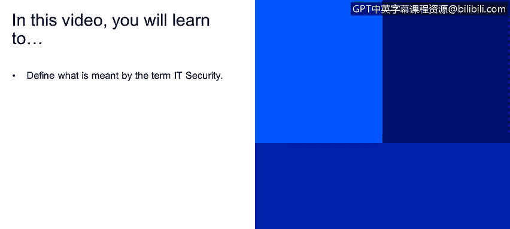

# IBM网络安全分析师专业证书课程2：《网络安全角色、流程与操作系统安全》roles-processes-operating-system-security - P41：2_05_what-is-it-security.en_subtitled - GPT中英字幕课程资源 - BV1G44y1F7oo

In this video， you will learn to define what is meant by the term IT security So what are were going to learn today we're going to learn regarding IT security view。

What is the st that we hear， we have a term here in the slide but I'm going to start to explain this a little bit better。

 we can define IT security as the practice of defending computer， servers， mobile devices。

 electronic systems， networks， its data from mal attacks。

This term can also be known as information security or cybersecur on the field。

