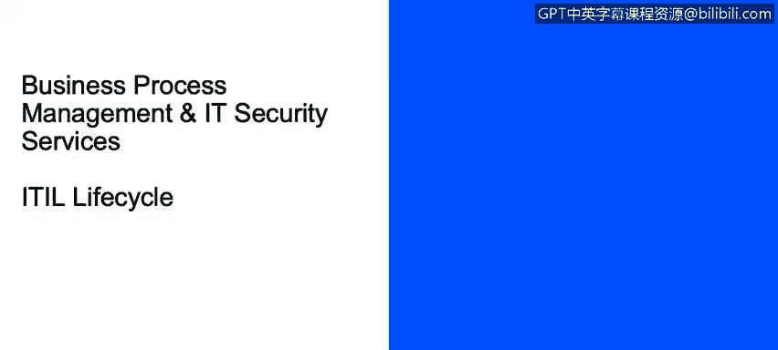

# IBM网络安全分析师专业证书课程2：《网络安全角色、流程与操作系统安全》roles-processes-operating-system-security - P46：7_03_information-technology-infrastructure-library-itil-overview.en_subtitled - GPT中英字幕课程资源 - BV1G44y1F7oo

In this video， you will learn to define the IT Infrastructure Library， describe service strategy。

 service design and service operations as it relates to ITL。

And describe continual service improvement。ITle life cycle。

 I wanted to take you just to a very high level of IL and their life cycles。

 This is not an IBM invention or development。 This was developed。

Outside in an industry， industry professionals， consultants。And it's been a number of years now。

 but it's。It is a great method and framework。I told the find it's really a best practice。

 like I said， framework。And I've seen it used across many different types of companies， public。

 private sector， IBM， we use it in many of our inner organizations。I think it has been very helpful。

It really， it is a framework provided。To companies， not that it needs to be。

Implemented exactly as the developers outlined it。 It's a guideline。It describes really how we。

 as an it organization， need to better organize and provide business value with all the It processes that we implement the developers。

Of Iil came up with life cycle phases， which I thought was really great。And it's a very logical flow。

Strategy， design， transition， operations and improvement。So it's a very logical progression。

 if you will。For instance， service strategy。I'm in the IT organization of my company。

I want to have a strategy that says， here's how I'm going to support my customers。

 which are a lot of the business units in my company。The finance group， the marketing group。

 advertising， the sales team。How am I as an IT group going to support them and what am I going to provide？

It's really。推见。Understanding my offerings， my capabilities and what I can provide to them as my customer。

And within service strategy， ITL has developed a number of subprosses， like the ones listed here。

There are actually more than I've listed。But this will give you a flavor of what they are suggesting。

Service portfolio management。Really how are we going to manage the service portfolio of what we provide。

 an example might be we provide help desk support。For our internal organization。Well， is that 24 by7。

 are theres certain parameters， but that is the type of thing we'll throw into our service portfolio。

Financial management is。Really， how。We're going to budget， do our accounting， et cetera for。

To reach our strategy goals as an IT group， security group。Demand management is really understanding。

 anticipating requirements that might come to us by our customers。

 whether they're external customers or our internal business units。

And then business relationship management。Is how are we going to。

Maintain a positive relationship with our internal customers or external customers。

 What is the process that we'll use to ensure。That we hear them。

 that we're taking action on what they say。So that was。Service strategy。 that was the very first。

 and many， many of our organizations。As yours， we probably have It processes in place。

 and we're not necessarily developing new strategies， but。

This is one way you can take a look at ITL against your strategy。

 and there might be ways you can improve。And refine your strategy。The next。

Phase or cycle is service design。And this has to do with designing new services。

IT security services that you might provide， as well as changes to existing ones。

Some of the subprosses include service catalog management。En ensuringsuring there is a catalog。

Is produced and maintain containing accurate information of all the services。That we provide。

The Help deskk example might be in that service catalog。Service level management。

Sometimes you might hear of this as SLA management， service level agreement。

It's basically those written or understood terms between you and your customers on the levels of performance。

Setting targets。We're going to complete a help desk ticket within X hours。

 that type of thing and the measuring performance against that objective。

Information security management。 This is。Just really ensuring the confidentiality。

 integrity and availability of the organization's information。It's the data and the IT services。

Supplier management。This is ensuring that。We have contracts with those suppliers that we need to to provide。

What we need as an I security group to do our jobs。So that was design strategy design。

And then we go to transition。The objective of。Service transition is to build and deploy IT services。

Existing， changing existing or new。And we're transitioning them from current state to a steady state。

So things like change management， which we're all familiar with the control of life cycle of all changes。

That is under service transition。It's a process for ensuring we do changes with a quality。Aspect。

It's project management。Projects that coordinate the resources deploying， for example。

 like a release within your environment。Release and deployment。Planning， scheduling。

 controlling the movement of releases。To test in live environments。And within all these。

 communication is so important because this is not an area。 We want surprises。Where all of a sudden。

 there are outages because we put a change in， and no one in the business units knew about it。

So communication is cuts through all of these。Service validation and testing。

Ensuring that deployed point releases and the resulting services that they all meet。

Customer expectations， whether internal or external。

 The last 1 I've listed and there are other subprosses under transition。

 but knowledge management is important。 This is where we seek together gather， analyze and store。

Knowledge learned and information that can be shared across our organization， whether it's。

Just in it security in your company or across the corporate wide。So then we move into the next phase。

 which is service apps， service operations。I call this one steady state because we've gone from transition。

We are executing。 We're in steady state。We're monitoring， we're executing those type of things。

And just a couple of the processes underserv apps that I've listed here。

Event management is a key it's。That's making sure that configuration items and services are constantly monitored。

It's categorizing events。And then， taking appropriate actions。Incident management。

This is managing the life cycle of all incidents。And we'll go into that a little deeper in a little bit。

Problem management likewise the managing life cycle of all problems。And really。

 the goal of service apps is to make sure that our IT services that we are providing to the business units。

Or external clients that they're delivered effectively and efficiently。

 And that's where that whole process discussion comes in。

 where reduce a variation by having standardized， repeatable It security processes。The last of。

 the lifecycle phases of ITL， which is one of my favorites because this is what I've been involved in with IBM for many years is continual service improvement。

 where it's just as it says， it's like we discussed before， we're continually reviewing metrics。

We're identifying gaps in current service processes。We're looking。For how we think it should be。

 we're trying to reduce the gaps。We're testing and prioritizing， you we select。

What we think is the best opportunity to improve。 And then we implement。

So it's that continuous wheel， it's of always trying to improve。

Your process。