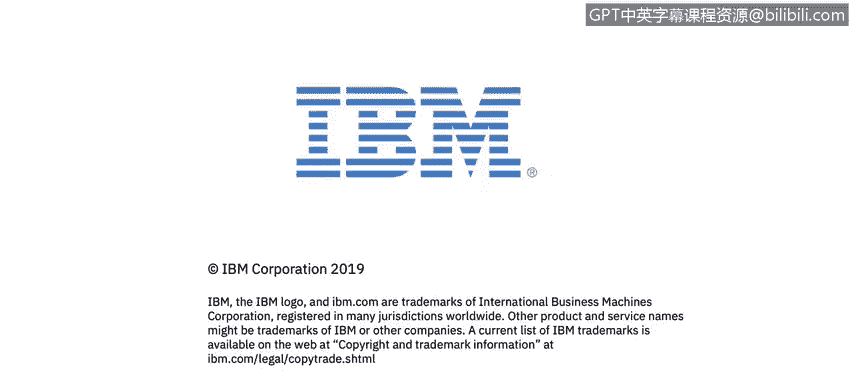

# IBM网络安全分析师专业证书课程2：《网络安全角色、流程与操作系统安全》roles-processes-operating-system-security - P49：10_01_who-are-alice-bob-and-trudy.en_subtitled - GPT中英字幕课程资源 - BV1G44y1F7oo

In this video， you will learn to describe the Alice， Bob and Trudy actors and what each represents。

let's take a look at。The playing field so that we can get the lexicon the terms defined in the actress。

Well， so Alice Bob and Trudy， you see this。Throughout cryptography literature。 And so it's A， B。

And T are the actors。 But back in the 60s in a few papers， these were given names， Alice。

 Bob and Trudy， and they continue today。 So Bob and Alice， right want to communicate securely。

 It can be for any reason a personal reason or business reason。Trrudy， who is the interceptor。

 desires to intercept， delete， men add messages， change messages， effectively a bad actor。

 So we take a look at the diagram here on slide 7。 And we see Alice on the right hand side。

 And Alice has some data。 This could be an email。 It could be a note。Could be a web page。

 number of elements for that。And she secures this message。Moving from clear tax。To cipher text。

Transmits it across a channel。 Now， the channel can be。

Any any form of transmission that we that we can consider， so certainly email direct transfer。

 file transfer protocol， it could be a text message these days。Back in the in the Napoleonic period。

 this would be a letter that a young naval midshipman may carry between Whitehall and。

Other parts of London。 So the channel， right， is the transmission mechanism。

 And within the channel is the data。 This is the payload。Right control messages， who' is it going to。

 how long is it good for what's the address of the recipient Bob in this case， you know。

 obviously in the internet world we look at IP addresses。

 we look at Mac addresses in the manual world we think about the Napoleonic era。

 when British intelligence started its ascendancy， this would be a name and a physical mailing address。

So physical mailing addresses are manual interpretations of control messages。

So Bob receives the message， decodes it and has the clear text that Allson sent to him Trudy has the ability to intercept these messages on the channel。

 but because of the secure nature of the encryption the protection for that cannot read。

 or delete or alter those messages。

