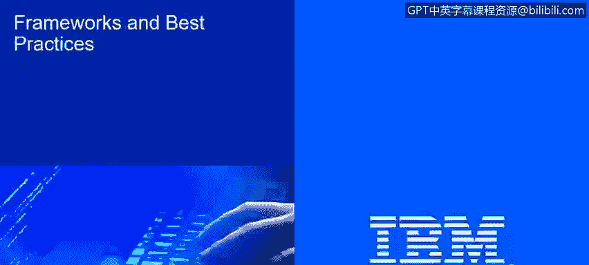
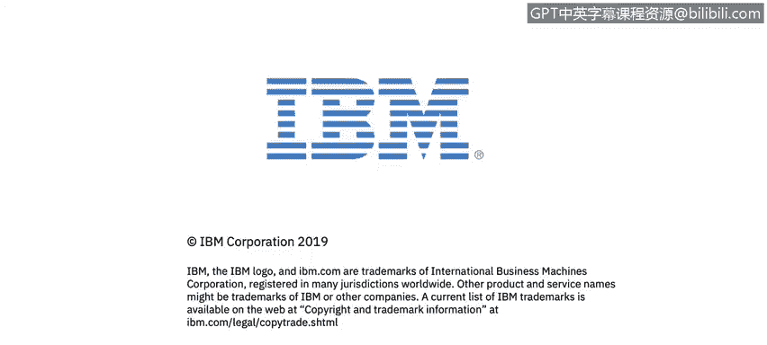

# IBM网络安全分析师专业证书课程2：《网络安全角色、流程与操作系统安全》roles-processes-operating-system-security - P4：3_框架及其目的.zh - GPT中英字幕课程资源 - BV1G44y1F7oo

That。

In this video， you will learn too。Describe the purpose of frameworks， baselines。

 and best practices in an effective cybersecurity strategy。

the last part of this session is frameworks and there's purposes。

 we're going to talk about frameworks， we're going to talk about best practices and here is just a good differentiation between best practices。

 baseline frameworks， normative and compliance。

In the organization， we will have a lot of things we will have， for example， best friends。

We will have a baseline， or we will have framework。

 A good example of framework is copied or a good example of best practices。 In some cases。

 framework depends of your business is。I T Iil， Iil。 So those are good things。

 good controls that will improve。Enhance your I governance， your I processes， your I policies。

 your I procedures， those frameworks， those baseline。

 those best practices will improve the performance of your servers， for example。

 if you go and grab the best practices for Microsoft regarding the hardening of their database server。

 for example， you will have a best Microsoft SQL server。

 you will have an improved Microsoft SQL server， but that best practices。

 that framework is not something that you will have to have。

 It's a nice to have you will have a lot of good practices， you will have a lot of controls。

 you will have a lot of good things， but if you don't have it。

 that's good that's something that will will not necessarily harm your business。

 if you don't have guidelines from Microsoft to implement the servers。

 if you don't have the guidelines from。to implement the Cisco devices。

 if you don't have the best practices from COVID to improve your IT governance in your company。

 you won lose your business， you won't be part of any kind of problem with your regulator with your government in the other corner we have normative and compliance。

The difference here is you need to implement normative。

 you need to have compliance if your business required that， so for example。

 there is something called HIPAA HIPAA is a normative that will be part of any kind of healthcare company in United States so you could have in your healthcare company。

 you could have COI， you could have a lot of ITIL processes。

 you could have all the best practices from your vendors implemented in your systems。

 but if you don't meet if you don't comply， if you don't comply with HIPAA， if you miss two points。

 if you miss two processes in HIPAA， probably you won't operate in United States。

 you will have penalties from the US government because you are not comping with HIPAA。

 so that's the main difference between baselines， frameworks and best practices and normative and compliance。

😡，So as we mentioned， we have a lot of things。 We have， for example， best practices as frameworks。

 methodologies that we could implement in our business to improve the way that our business still deals with technology。

 And we could mention actually， we already mentioned a couple of those。 We could mention Covid。

 We could mention Iil Ios on cybersecur。 We have。H， so just 7，000 series， we have CAL。

 we have the PMI， the Pra management Institute with a lot of project management methodologies。

 we have the developer recommendations， as soon as you start working with a network or sorry with a programming languages。

 you will have a lot of documentation you will have a lot of information regarding the best practices that you could follow on your software in your systems to avoid any kind of security incidents。

 any kind of incident that will harm or will destroy your software。

