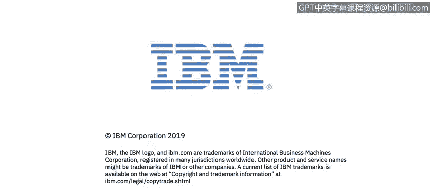

# IBM网络安全分析师专业证书课程2：《网络安全角色、流程与操作系统安全》roles-processes-operating-system-security - P50：11_02_confidentiality-integrity-and-availability.en_subtitled - GPT中英字幕课程资源 - BV1G44y1F7oo

In this video， you will learn to describe the CIA Triad and how confidentiality。

 integrity and availability are defined in the context of cybersecurity。

 Three main components of what security architecture that's confidentiality integrity and availability they protect。

Data and services within the architecture， which you don't see here also is the authentication side。

And the access item， we'll talk more about that a little bit later。

 So let's take a dive a little bit deeper。Into the definitions for confidentiality， integrity。

 and availability。Is a Nist level。Definition of confidentiality。

 So let's take a look at this in some detail。Sorry。

 so preserving authorized restrictions on information access and disclosure。

 including means for protecting personal privacy。And proprietary information。

So let's de components this first。For what point just a little bit。So preserving。

Authorized restrictions。Meaning that we've got controlled protocols that explain not only how but。唔一。

What mechanisms are undertaken to have access to the information at hand？And the。

So there are authorized restrictions， right these comes from the governance process。

Which implies that we will protect against unauthorized restrictions with a great denial of service attack。

 for example， to simply。Prevent any any access at all by authorized users。

 so we've got to preserve the governance， the protocol for access to the information。

Obviously on information access and disclosures， so not only being able to read it。

 being able to distribute that are under the purview of access control and maintaining confidentiality for Bob and analysis。

 this absolutely makes sense。Right so only All and Bob can change how they exchange information and how they protect that and the means for protecting personal privacy right in the channel before Trudy intercepts。

And proprietary information builders are two main domains for。Confidentiality within the。

And we define a failure。A confidentialitylo as the unauthorized disclosure of information。

Guarding against improper information， modification or destruction。

 so this is the in channel distribution that we're protecting information。Now。Interestingly enough。

There's some US government agencies。They care more about integrity。Then they do confidentiality。

So Alicea Bob， so Trudy can intercept that， but she can't。

 government these government agencies have a laser focus。That truly can't change the message。

That's the integrity sort。 That's the guarding against the improper information modification。Right。

 so。A terrible， terrible set of circumstances would be that treaty in our earlier diagram。

Could modify a message and neither Alice nor Bob can be aware of that so the simple let's meet for lunch today can be changed to let's meet for lunch tomorrow。

One person shows up， they feel like they're stood up， all sorts of complications occur there。

 so one can understand information the impact to a mission of a lack of integrity。

So also within the integrity side of this is the non repudiation and authenticity。Components to this。

Non repudiation means that neither the send nor the receiver。Alice nor Bob。

Can challenge that a transaction occurred？Well， let's define what the transaction could be in a simple part of it it could be。

That the lunch invitation was extended， the message was sent。

So Alice can prove that the message was sent。And can prove that Bob received the message。

 so Bob can never say。I didn't get the message。Because Alice would have the proof that it was sent and it was delivered now that's a simple non repudiation definition let's take a look at a business transaction。

In a banking environment， a transfer of $100 from the savings account to a。

Checking account or from Alice's account to Bob's account， let's take a look at the second。

So the non repudiations， Alice。Can prove。That she moved$00 dollars from her account to Bob's account。

And the Bob's aware of that。So Bob could never say that $100 was never moved。Because we have。

Message constructs， audit records that proved the fact that Alice made the transaction。Alice。

Can prove that those transactions occurred also so that it occurs from the send side and the receiver side that's the non repudiation parameter that we're discussing in here。

The authenticity element the fact addresses the principle that it was a legitimate transaction。

 so the $100 that moved from Alice's account to Bob's account was conducted by their bank。

Not some third part。Right so this is that it is an authorized。Transaction。

It occurred within the rules。There's no integrity violations， that's the authenticity side。

 so the definition of an integrity failure or the integrity loss is the unauthorized modification or destruction of information。

In the larger context is that if true to the interceptor。

Destroyed a message and prevented its delivery。That is also an integrity failure。

 so she not only changed the message， but she destroyed that。So our availability definition。

 this is the last of the three definitions on this， right。

 talk about the timely and reliable access to information。Well， this makes sense。

 basically we talk about system reliability。The system will be available 99。

99% of the time that's the type of requirement that we see for system availability。

The security engineer， the security professional， will take that availability requirement and be able to decompose that to the deployment architecture so that we can talk about availability。

For individual components， the sum of which will meet the requirement。

So notice there are two components too。Let's just take out the second one and we'll talk about the timely access to information。

Right， so the ability that a。And this frequently is a system level。Requirement。

That when a transaction request is put onto the channel， that the transaction response occurs。

Within a set length of time， let's say five seconds。

Now for air traffic control radar and fire control systems that timely access is measured in microseconds。

So once again， frequently part of the system requirements。Mattrix。The reliable access component。

 this is the actual system availability， so we're not talking about how long it takes。

 but in fact that it does take。And so we frequently talk about percentage of availability time on this is's a couple of other parameters that。

can help define reliable access， but once again， the security professional will take a look at these requirements and perform a requirements decomposition and then allocate those requirements to elements within the architecture。

So our definition of loss availability is the disruption of access。To an information system。

That just makes sense that it's。Going to have access responsibly right within a certain time limit and in fact。

 that the transaction can occur。

