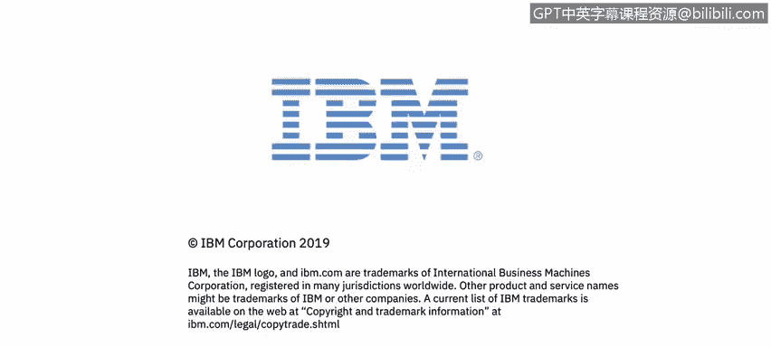

# IBM网络安全分析师专业证书课程2：《网络安全角色、流程与操作系统安全》roles-processes-operating-system-security - P51：12_03_authenticity-and-accountability.en_subtitled - GPT中英字幕课程资源 - BV1G44y1F7oo

In this video， you will learn to discuss what is meant by authenticity and accountability in the context of cybersecurity。

last set of definitions that we will work on this module address authenticate authenticity and accountability。

 right， authenticity is the property of being genuine and verifiable。

 So when Alice sends Bob a message that Bob can， in fact。

Prove that the message is fact genuine from Alice and is the correct protocol and is what is expected and can be verified with that。

And the accountability side of this is that Bob receiving a message from Alice can prove。

 in fact that it did come from Alice， so we think about this in a banking environment you instantly see the application that the banking system。

When they。Action is taken upon the account to deposit some money to transfer some money absolutely maps that to a known individual。

