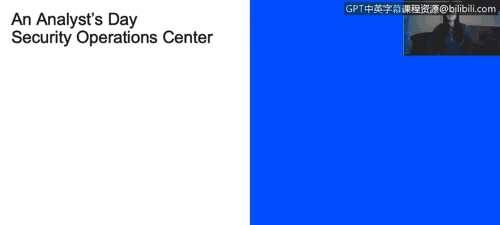

# IBM网络安全分析师专业证书课程2：《网络安全角色、流程与操作系统安全》roles-processes-operating-system-security - P52：13_01_priscilla-mariel-guzman-angulo-whats-important-for-my-job.en_subtitled - GPT中英字幕课程资源 - BV1G44y1F7oo

Hi， my name is Priilla Guzman。 I work for IBM Costa Rica in the Department of Cyberse。

 My job position is as MCn admin， and I have to deal constantly with different technical issues that the IBM curator security information and event management software could have。

Every day， there is a new challenge， So there is no typical day。

 Sometimes we have to use tools such as explores， Know center。

 or consider to take some certifications in the area to improve our knowledge。

We have to keep learning constantly， and I consider this helps me to stay up to with the new technologies and new emerging cyber attacks and threat。

For me， the most rewarding part to work in the cyber cyberse area is to help customers to protect their sensitive data and environments from attacks that we could have day by day。

 In my particular case， I think this is one of the best technology jobs。We have in the present。

 Thank you。

