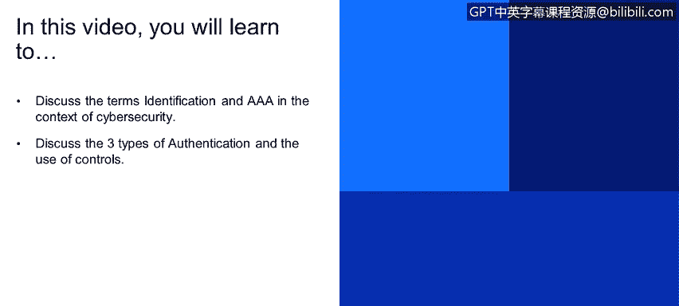
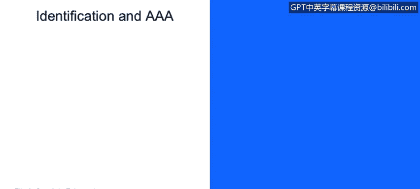

# IBM网络安全分析师专业证书课程2：《网络安全角色、流程与操作系统安全》roles-processes-operating-system-security - P54：15_02_identification-and-aaa.en_subtitled - GPT中英字幕课程资源 - BV1G44y1F7oo

In this video， you will learn to discuss the terms identification and AAA in the context of cyberseity。

 You'll also learn how to discuss the three types of authentication and the use of controls。

Identifications and an A3A。

Identification， What is identification， It's when we first printed ourselves against a resource。

This could be by a username and password， this could be by a token。

 let's use authenticating against a。Social network as an example。

Once we present ourselves with the UM password， the application or the resource is going to authenticate us against its resources。

So it's going to make sure that we actually exist under that environment。

From there is going to authorize us or you're going to be give us the proposed rights in order to access that information。

 If we're using the social network example， we should be getting a user type of role associated with us。

 We shouldn't been able to。Use any adme type of rights。From there。

 we're going to be able to have accountability to the things that we do。

We spoke about this in an earlier chapters， so we're going to have the accountability all the things that we do with that ID or the authentic authenticated ID。

We're going to explain a little bit better how this works。In order to use a resource。

 we first need to identify to get the prepared rights。

And the authorization in order to use that resource， When we use that resource。

 we're going to actually get some accountability of our action。

 So everything that we do is going to keep a lot of things。

Then we're going to talk about authentication methods。There are many metal soldder。

 this can be summarize I 3。First thing something that you know。What is something that I know？

Could be a username and a password。Then something that I have。Usually。

 this is being broadly used with banking trend to upscalell the security。

They usually give us a token or a smart card。Then that's something that you are。 what are we。

 What can we provide， This usually falls with biometric controls。In this case。

 we're going to use fingerprints as an example。Something that you have， as you can see。

 this is something that we use on daily lives。We have a credit card with that chip。

 that chip is something that we have and we authenticated with it。In some countries， for example。

 in the US， when you use a credit card， you need to put a pin that is something that I know。

 and then something that I have， I actually confirm that with the chip that I have。

Also the RCA token， when I authentic against a banking site。

 I know that they gave me user a password， but the RCA token would actually create a random number or token in order to confirm that it's me that I'm logging into that resource。

So something that you have is going to be something physical。It could be an up in your phone。

 it could be another piece of hardware， but it's something that we're going to actually have with you。

Something that you are。 What are we， What can we provide to the through a server or to an a method。

There are many， many things out there， things all away from brainwa frequencies。

But the most commonly use are fingerprints。Fingerprints， retina scanners and biometric signatures。

 which could fall into anything really。What's the basic flow of this。

 it's going to start with the biometric capturing。🤢。

Then we're going to translate that image or that sample from the biometric capture into a bit byte so as the computer can understand and create an algorithm and find that pattern unique pattern against us。

 is's going to take that and compare against the one that has in its database and is's going to give us a match。

 usually there is a range of error in this case for biometric capture for fingerprints。

 we have a 90% chance will actually being accurate for it， there's a 5% error。Controls。

 we're going to speak controls that we have or that we use on a daily basis。

 This has been summarizeon 3 administrative， technical and physical administrative controls could be any policy or procedure that we have in our enterprise。

 It could be such a thing as a spaM policy。For example。

 the many enterprise if you receive an email if most reported at the spam。

 that it's something that we can use to prevent that amountma we coming into our system。

When ministry controls or when the user behavior is in place。

 we can also add a layer of security with technical controls with what could be a technical control。

 in this case， it could be a firewall。Not only we have a policy control that when spa email comes into our work email。

 we need to report it， but in case somebody actually opens that information， we have a firewall。Also。

 we have our physical controls。Our physical controls could be anything but at this point。

 it could be a separate room。With having different biometric controls in order to get in。

 it could be a walk， be a door， anything that actually physically restrain us from reaching that resource。

So we spoke regarding the control tags that we have and we're going to speak a little bit of the subcategories that we also have on those。

 we have our corrective controls which actually correct support problem after discovering it。

 what can it be a corrective control could be a policy training。

 any kind of penalty for breaking those procedures that we have in our enterprise？

Preventive are things that actually happens to prevent or to uncover violations of internal controls。

 Why could it be something that is preventive， internal audits， random internal audits。Disuasive。

 we are trying to or with this and were trying to dis encourage violators。

This could be a camera on a server room， in order to prevent that type of odd behavior around the servers。

 maybe a person would stop or would think twice regarding doing something outside the policy or the company's policy because his movements are being recorded。

We also have our recovery controls with different things that actually recover us。

Case of a disaster on here， we could mention backups。

Then we have our detective controls which actually help us identify possible violations。On here。

 we can add。Our firewalls。Then， comp。On here， if we were able to identify a gap and then it wasn't enough to cover it with a。

Policy， which is an our control we're going to have a compensory control， which could be a firewall。

 just in case somebody actually clicks spa email in order to prevent that we're from coming to the enterprise。

 we're going to have a composory control that I actually we block any type of malware by adding that module into our firewall on here I'm going to share a little bit of a chart which actually goes a little bit more into a little more in depth into the control and type of controls。

Also have the type of control， the preventive type is corrective， dissuasive and recovering。

