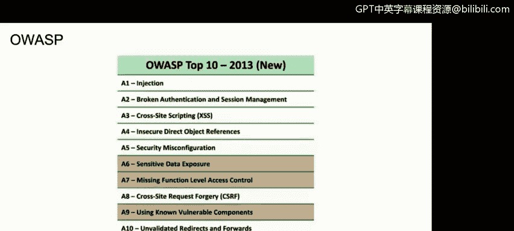
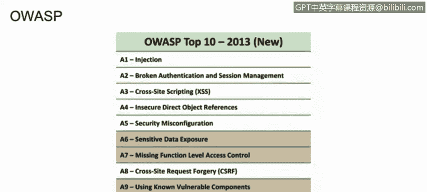
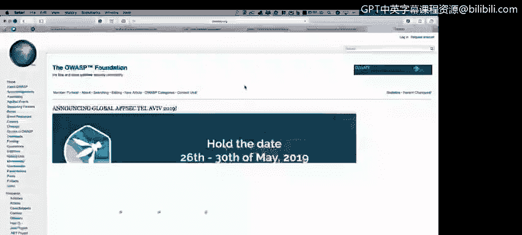
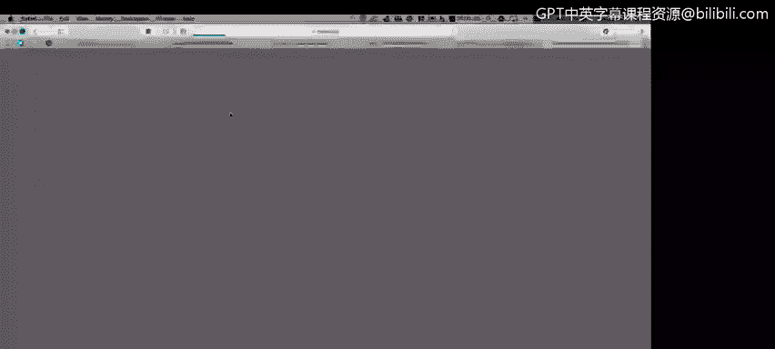
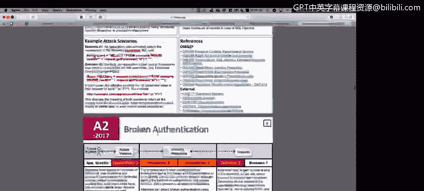

# IBM网络安全分析师专业证书课程2：《网络安全角色、流程与操作系统安全》roles-processes-operating-system-security - P57：18_01_open-web-application-security-project-owasp.en_subtitled - GPT中英字幕课程资源 - BV1G44y1F7oo

In this video， you will learn to discuss the Open Web application security project and find the top 10 Web application vulnerabilities for each recent years and how to address each。

Another methodology， another best practice。 that most of the web applications needs to follow。

 Here's the O top 10 process。 So if you are， if you're dealing with a web page。

 if you're dealing with a web application you are dealing with actually not necessarily a web application。

 But if you're dealing with applications at all， you could use the O top 10 and start performing test on each of the sections that the organization will have on their their website。

 So basically， O and。

We will see here a lot of information on OAS if you go to Google and to the OSS on the search part。

 you will go to the OA。org link and you will get a lot of information regarding this organization that will help you when you are trying to perform a test into your application into your web application。

 actually there is also a lot of information for mobile applications too， so for example。

 if you go to。

To downloads， you will see a lot of categories here。 So， for example。

 let's go to the top 10 top 10 project here。And you will see that the 1 top 10 for 2017。

It's now available so here you will un the report with all the different information for the top 10 vulnerabilities for the web applications on the last two。

 three years is 272017 so for example， we have as a number one injection So we go to page number7。

 heres an example of what is the waste injection， what is the process to get information for the system using sQL injection for example。

 what are be a taxes in areas， what are the queries that you need to perform in the system in order to know if your system is prompt or is vulnerable to injection and you have。

 for example here broken authentic， sensitive data exposure you have a lot of things to test a lot of things to prove and again。

 if you go to the main website， you will see a lot of download space something else known as。

checklist， it's a document where you will。Get a lot of documents。

 a lot of a lot of controls that you will need to implement。

 You will need to have on your web applications in order to ensure that your your web app is fully secure。

