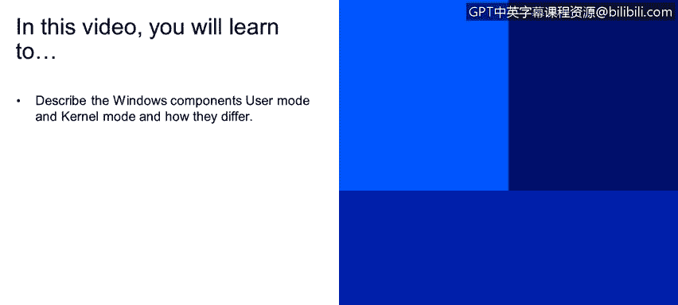

# IBM网络安全分析师专业证书课程2：《网络安全角色、流程与操作系统安全》roles-processes-operating-system-security - P59：20_02_user-and-kernel-mode.en_subtitled - GPT中英字幕课程资源 - BV1G44y1F7oo

In this video you will learn to describe the Windows components user mode and kernel mode and how they differ Hi there I'm going to talk to you today about a few quick concepts for Microsoft Windows let's jump right in。

Microsoft Windows developed by Microsoft Corporation has been around for a long time。

 pretty much anyone who has used a personal computer within the last 20 years probably has some experience with Windows。

 but really the best part of about Windows is it created the first graphical user interface that we're used to so where you can go in and use a mouse to point and click instead of having to type in commands and it was designed for IBM compatible PC so obviously。

Mintosh Apple devices will run their own operating system Windows will run on what we call IBM compatible PCs IBM as many of you may know。

 created the first portion computer in the early 80s approximately 90% of PCs worldwide run some version of Windows and servers as well run versions of Windows as well。

 so it's something that many of us are very familiar with。So there are a couple components。😡。

Associated with Windows or there are a couple components that Windows uses they have a user mode and kernel mode components user mode is really what you see when you are opening an application when you're using Microsoft Word or you're surfing the web with Chrome or Firefox or anything like that you're really accessing user mode。

And there are drivers that are used by that to create to create that IO。

 that input output that you're leveraging when you use an application like Microsoft Word or as I said。

 a web browser and then there's the kernel mode which is kind of the underlying technology within Windows where you have different processes and threads that actually control the applications that you're leveraging within Windows and within the user mode of Windows。

 so let's talk a little bit about the user mode， so when you start a user mode application。

 Windows creates what it calls a process for an application。

 anybody who's gone into task manager can see when you have application that are running。

 you will see those processes running inside inside the task manager that will tell you things like how much memory it's using。

How much CPU and CPU is your processor， how much processor it's using as you use that application。

The nice thing about applications is they're really pretty segmented from each other。

 so when you start an application that virtual address that is created。

A private so it's segmented from other applications within the environment so one application can't alter data that belongs to another application。

 each application runs in what we call isolation and if that application crashes it's not going to bring down the entire operating system it's only going to bring down that application so those other things that are going on are not affected by that crash。

😡，we talk about kernel mode， that everything that runs in kernel mode contains a single or shares a single virtual address so that kernel mode drivers are not。

😡，Isolated from other drivers and from the operating system itself。

 So if a kernel mode driver accidentally writes to the wrong virtual address or to something else within the operating system。

 that data within the operating system could be compromised。

 So if a kernel mode driver crashes the entire operating system would crash so you may have seen that where you get the blue screen of death as it's commonly called when your operating system stops and you have to reboot that's typically caused by a kernel mode failure or a driver within the kernel mode writing to virtual address that would cause an issue with the operating system。

