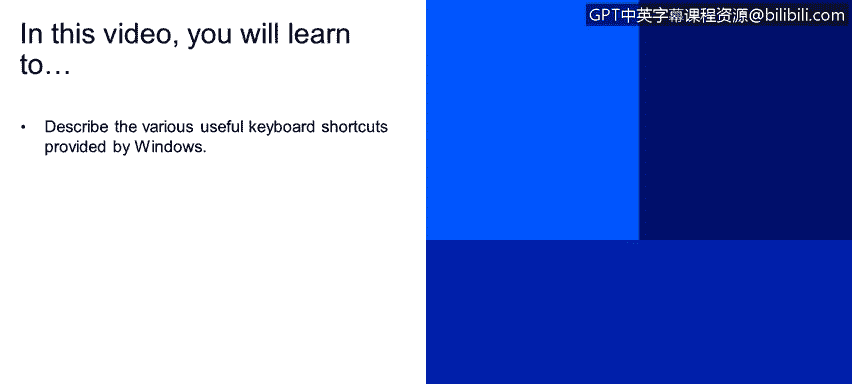
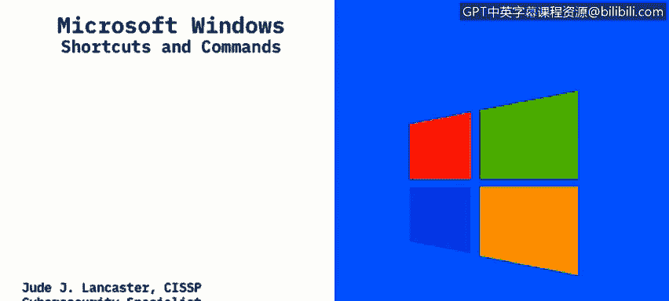
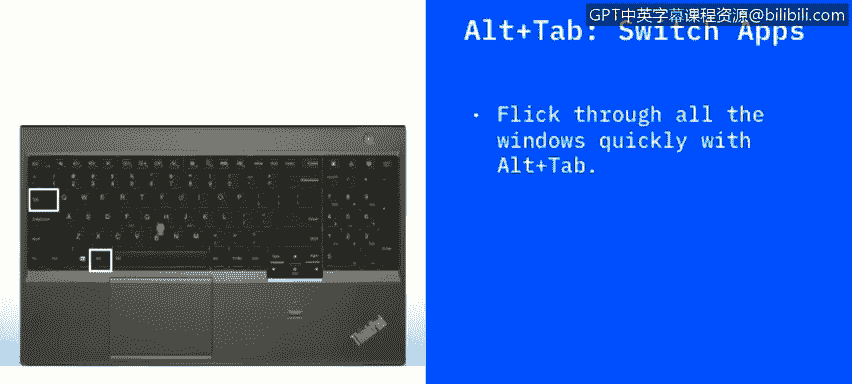

# IBM网络安全分析师专业证书课程2：《网络安全角色、流程与操作系统安全》roles-processes-operating-system-security - P62：23_01_shortcuts-and-commands.en_subtitled - GPT中英字幕课程资源 - BV1G44y1F7oo

In this video， you will learn to describe the various useful keyboard shortcuts provided by Windows。

 So one of the nice things about Windows is we have that graphical user interface where we can use a mouse and a keyboard and other input devices to do things within the operating system。

 certainly， there's a command line interface that you would also see within Linux and command line interface is your predominant way to access a Linux or a Uni system。

 But with Windows， the predominant thing that most people like about Windows is that we have that graphical user interface that makes it easy for us to interact with applications with the operating system itself and whatever you want。

 So one of the things that Windows does provide are are shortcuts。 and those shortcuts are。😊。

Things that we can do on the keyboard without having to move the mouse around or just common tasks that we can speed up by using those keyboard shortcuts and they're typically accessed by using the windows and another key or the control key and another key they're really time savingaving and helpful for things that you will do regularly within Windows。

😡，So the first one we're going to talk about is control and the Z key or control+ Z to do an undo and really this is independent of the application。

 so it will roll back your last action， whether you overwritten a paragraph by accident in Microsoft Word or delete it a file you didn't mean to this is a great keyboard to undo your last thing because we certainly all make mistakes and I know I've used controls you probably more than I should。

 but it is really will help you if you made a mistake and want to undo your last action。

Cloose is another one that you can use if you have a lot of windows open in your system if you have the application or the window that is forefront in your system if you hit control plus W that will close that window and if you you're in the middle of editing something and open up your prompt to save it but that's another shortcut that can be handy as well。

 this is also very handy when you're copying and pasting text especially maybe from a web page or from some source and putting it into a document but this will highlight everything on a particular page and then you can take some action against it and this is very handy so you don't have to use your mouse and scroll all the way down on a long document or a long web page to grab everything on there you just hit the control+ A and that will select everything on the document。

Another one that is fairly prevalent and is helpful is alt tabab which will switch your apps。

 so if you have say Chrome in the forefront of your screen and you want to move to something else。

 you can just hit your alt tab， this will bring up a set of your windows and you can switch to the window that you want without having to use your mouse to go to the taskbar and switch between applications。

Alt+ F4 will close all your apps and this is kind of you know an old school shortcut's been around for a while but's very helpful if you want to close all your apps you can hit your al+ F4 and that will allow you to close everything and just exit to the Windows desktop it will also if you have something that needs to be saved within an application will' bring up the prompt to save it before it closes it so you won't lose any work or anything。

This one's also handy as well if you hit the Windows button plus the D button this will show or hide the desktop so it's like a toggle switch if you have a file that you want to look at on the desktop you can hit the Windows T plus plus D that will show your desktop。

 you can look at the file name or do whatever you need to do and then hit Windows D again and this will go back to the application E just in so that you can go back and hide the desktop so that's kind of a helpful a shortcut for that in that regard。

This will the wind left arrow and the wind right arrow will move a window to one side of the screen depending on which arrow you hit so if you have a window that is not taking up your full screen and you want to move it to one side or another so you can look at two windows at one time using the windows left or right arrow we'll snap it to one side or the other of the monitor and just give you more real estate to look at multiple windows at one time。

 helps you keep things organized。And this Windows plus the tab will open the task view this something's nice because it will show you a thumbnail of all the applications or all your open programs on the screen and then you can go and switch between them so it's just a faster way to open up the switch Windows because you can go directly to whatever application you want to by hitting that win plus the tab button and this one will go back and forth through your options when you have a dialog box so if you open up a dialog box within an application tab or shift tab will' move backward and forward through those options when you have a dialog box that has a lot of choices you can use tab or shift tab to quickly move through those without having to to scroll your mouse and this is just a faster way to do that。

