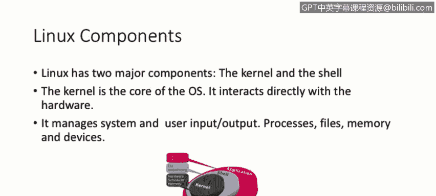
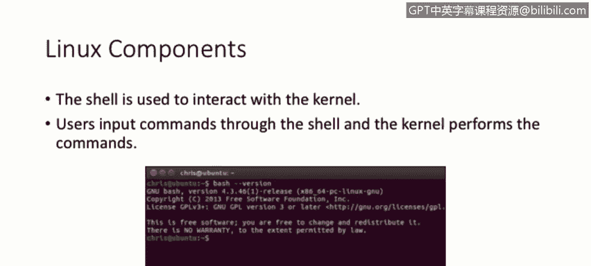
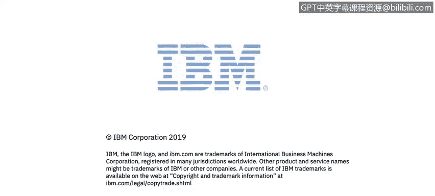

# IBM网络安全分析师专业证书课程2：《网络安全角色、流程与操作系统安全》roles-processes-operating-system-security - P64：25_01_key-components.en_subtitled - GPT中英字幕课程资源 - BV1G44y1F7oo

In this video， you will learn to describe what makes Linux unique as an operating system We're going to discuss some key concepts for Linux and the operating system。

Let's start with the definition of what it' Linux。 Linux is an operating system。 It's open source。

And its licensed under the general public license， also called GL。

Thisizing guarantees that the end users， basically ourselves， have the freedom to run， study， share。

 and modify the software。But this has one。 you can study this over。 you can modify it。

 You can share it。 But as long as your modifications are also licensed under the general public license as well or the G license。

Linux have some components， but there are two main components that we're going to discuss now。

 They are the kernel。And also， the kill。The kernel is basically the core of the operating system。

It's designed to interact directly with the hardware itself。Itagages。

The system and the user input output。Processes， files， memory and devices。

On top of that。We have the shell， which is like an interface designed for the user to interact directly with the kernel。

On the screenshot in the middle of the slide， you will see what's also called like the CLI or the commandI interface。

This is the shell for AU go to system， and the user typess in commands in this interface。

 then the kernel will perform those commands。

For the usage。

