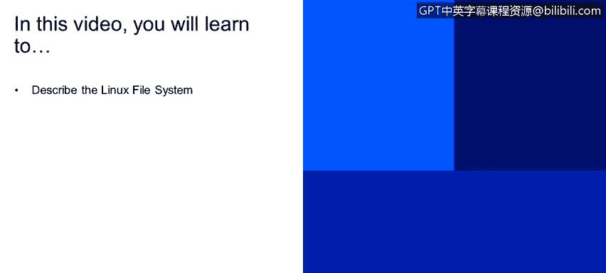
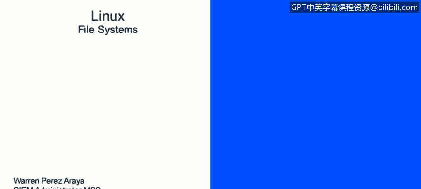

# IBM网络安全分析师专业证书课程2：《网络安全角色、流程与操作系统安全》roles-processes-operating-system-security - P65：26_01_file-systems.en_subtitled - GPT中英字幕课程资源 - BV1G44y1F7oo

In this video， you will learn to describe the Linux file system。Next。

 we're going to discuss how Linux and the file systems。Was designed or is designed。

 Let's talk about first， about files and directories。

Fileles files be a basic unique of storage for data。This unit。

 is's basically a store or pretty much a store on a physical media， such as hard drive。

 a thumb drive or anything that is designed to store information。It's represented by a dash。

 and we'll discuss this later on。A directory， on the other hand， it that in a special type of file。

 a directory has information about other files。 So iss that a container for files。

And it's the equivalent of folders in Windows。And Linuxux is represented by a letter D in the command line matrix in the screenshot below or the image below。

 you will see the highlighted directory that are on the first letters your right on your left con。

 you will see that it starts with the D that indicates that that' specific。Item right there。

 It's our directory。But you will see just above that， not a copy of THD。 It starts with the dash。

 So I indicates the that specifically a file。Linnuux and the directory structure is a lot different than what we used in Windows。

Everything starts with this slash， also called the root。 and everything else， it's just。Quote。

 unquote， attach to the slash partition or the root partition。These last partition also called root。

It's where every single file undirected starts from。

Only the group usually has right privileges under this directory。

 And that's supposed to be like that for the two reasons。The s part。

 it's not the same as the s route。Thislash route is basically the home directory of the user route。

 We'll discuss home directors in a little bit。Uselash bin directory， it contains binary executables。

 basically。Common Linux commands are found here， and we have a list there， PS， Ls， in rep， CPpM V。

We'll discuss a little bit more about basic comments and the machine in the couple sites。

Theselash as being， it contains executable binaries as well。

 but they're more related to system maintenance tests like Ip tables。

 like the Re would command the F this or the If conflict， for example。D large CC。It's where。

Most of the times， we will assign configuration files for all the programs installed stock。

If we have a Linux server and we install Apache on that server for the configuration of that specific service。

 you will go to slash Epc， s Apache and You will find all the configuration files on that directed for specific applications。

Do slash floor。It's in a specific petition designed to hold files that grow or change constantly。

Its referred as variable files。And at a perfect example for these are logs。

 they're usually fine under slash bar s logs， all the applications or most of the applications that you will find out there will create their logs under barss under a slash bar slash log。

Theselash GMP partition， it contains temporary files。

So anything the use store under s TmpP will get deleted when the system reboots。

This is not meant to hold files。Like any other part will do。

 anything that is so in their s TmpP whenever the system reots will get needed。

This large home petition， it's the home direct to all the users。

So whenever a user it' created and it creates a home directory， you will find it under s home。

 this is designed to store personal files for each individual user and this specific part will only have privileges for this specific user so let's say I created a user called Warren that will be the home director for that will be under slash home/lash Warren and only Warren will be able to edit or read files from that specific directory。

Another important partition is use s boot partition。 It contains boot loader files。

 This partition is specifically used during boot time。And now that we talk about good time。

 we also have different run levels that UniX or run Linux uses for specific cash or specificna。

 the run level of0， is's basically sort of a shutdown for the system， it halts the system。

And all the services are stopped， and the system will not be rebooted after a run level series executed in the system。

We also have row level one。This is a room level where only one user can use the system。

It does not have network capabilities。 This is for maintenance， specifically done on the Oed。

 directly。We also have the bookee issue with note network support， that'll be run level number two。

It's also used for maintenance and system testing specifically。We also have Bro level  three。

Which is a multi user， we also networks report。This will be if， for example。

 we have a server only with a no graphical interface， just a basic CLI command interface。

 This is where that specific server will run at， as will be run level4。It has no graphical interface。

 It's a text mode， only。But it hasn it supporting all the necessary services running for that specific server。

We have room level4， which's a custom mode。It's used by system administrators。

 and it could be customized for specific needs。Round level 5 it's a graphical interface。

 also called X 11。It's similar to Ro level 3 with the exception that it has a graphical login and a graphical interface for the user。

And finally， we got run level6 that basically indicates the system that has to reboot and reload every service running on the system。

