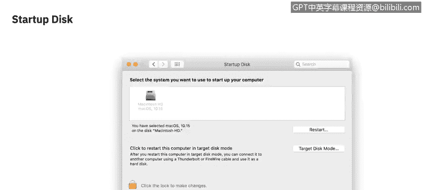
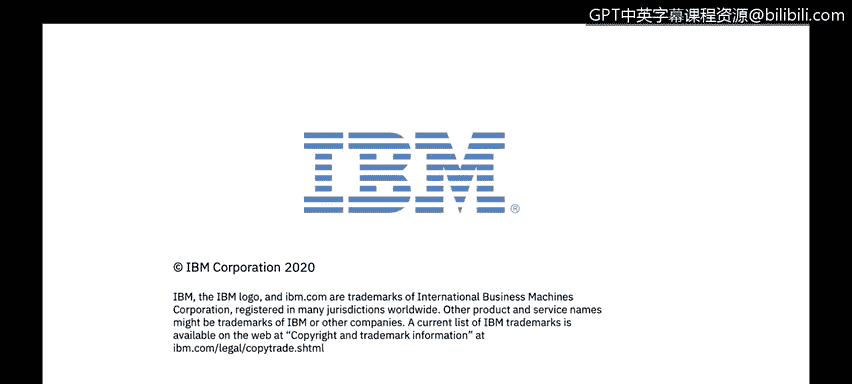

# IBM网络安全分析师专业证书课程2：《网络安全角色、流程与操作系统安全》roles-processes-operating-system-security - P69：30_02_macos-security-settings.en_subtitled - GPT中英字幕课程资源 - BV1G44y1F7oo

Welcome to Macco West Security settings brought to you by IBM。

 This video will be learning about the various security settings within Macs。😊，Let's get started。

 All of the settings we'll be discussing in this video are found within the system preferences in Mac OS。

 system preferences can be found under the Apple menu， or likely on the dock。

 It's the silver box with the gear in it。As you can see。

 there are a lot of different preferences to sort through for the scope of this video。

 We'll be sticking to the ones that pertain to security and privacy。 So that's where we'll start。

 the security and privacy settings。Within the security and privacy settings window。

 there are four main tabs。 When you first open it， it should be on the first， which is general。

Here we can see two different categories of settings。

 The first is going to be around the administrator password。 This is where you can change that。

And then below that， kind of divisible by the line in the middle is going to be gatekeeper。

 It's not labeled， but this is the functionality within Mac O that prevents unauthorized third party apps from being installed。

 to clarify a third party app in this case is any application that's not installed from the Apple app store。

 So if you were to just go to an Internet browser and download。

 let's say Google Chrome for an example， you would get a prompt saying that this is a third party application Are you sure you would like to do this at which point you would have to override gatekeeper。

 Now， in some circumstances， gatekeeper might just tell you that you cannot open a DG file。

 which is the disk image。 The default installer file in Mac O。 to get around that。

 you can actually just right click the file and hit open to bypass gatekeeper that way。

The second tab is going to be the file vault settings。 fileile vault is Mac OS's encryption。

 where it'll encrypt your entire hard drive。 This setting specifically is for setting a password for it。

 This is very important because if you lose this， there is no recovering your data。

The firewall settings is going to be an on or off option unless you go under the advanced settings。

 where you see you can block all incoming connections or white list specific ones with a few other options。

The privacy tab holds the most options。 And as of Macko West Catalina， got a massive overhaul。

These settings exist so that when anything tries to access a service or application on your computer。

 it requires your permission to do so。 So things like location services or access to your webcam camera。

 your microphone， input monitoring。 So typing on your keyboard if they want to see key input。

 if they want to share your screen or share analytics or have access to your files。

 every little thing here is going to need your permission。

 So each application will request it individually。 It's not a blanket allow this for all applications。

 each new time you launch that application for the first time， it will ask for settings。

 which many see to be a pan， but overall increases the security profile of the computer。

The last thing I want to go over isn't insecurity and privacy， it's actually under startup disk。

 This is where you can see any partition that's on the internal drive as well as any connected or network to drives you can select and restart to boot up into those drives or you can boot into target disk mode which turns the current active computer into an external hard drive to show up on another network device。

For security settings， we'll see in the next video。

