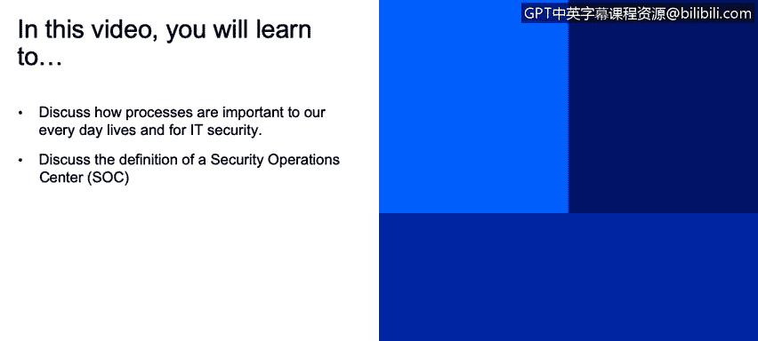
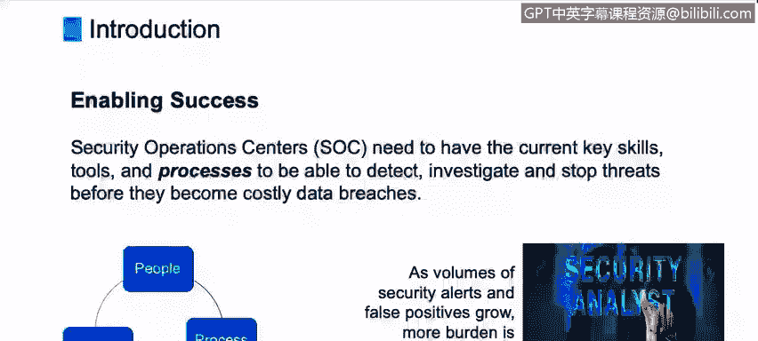

# IBM网络安全分析师专业证书课程2：《网络安全角色、流程与操作系统安全》roles-processes-operating-system-security - P6：5_流程简介.zh - GPT中英字幕课程资源 - BV1G44y1F7oo

In this video， you will learn to discuss how processes are important to our everyday lives and for IT security and discuss the definition of a security operation center。

Hi， welcome to the training on Business Pro Management and IT Security Services。

 My name is Joe Spino， and I am a business process analyst at IBM Corporation。Today。

 I'd like to provide some insight and training after we go through a little bit of an introduction on business process management。

Or BPPM。IT Infrastructure library， commonly referred to as ITil。And lastly。

 dig in a little deeper on some of the ITL processes。And this all relates to IT security services。

And let's get started。

Processes are part of our everyday lives。 We are engaging in processes， personally。

 and professionally。An example。Might be what I experienced yesterday。

 I had to get some money from my checking account。So I drove over to my local bank。The ATM machine。

I inserted my debit card， which really kicks off the process。And internally。

 what I'm not seeing as the customer on the outside， internally within the bank system。

 it's going through a series of validation checks， looking at my card。

Trying to make sure there was no fraud involved that my card wasn't reported stolen。

So it's got a validation process。These are steps it takes internally。

And then I plug in my pinI number and it validates that。The system retrieves my account information。

 it'll go in and look at my account balance， so I have enough money in there to draw some out。

And it completes all of its checking， it asks me how much do you want to take out？😡。

I enter the amount in the keypad。It will ask me how I like that and what type bills It updates my account and dispenses the cash。

 The cash comes out。 My little card pops out。And the final step in the process。

 it spits out a little receipt that I take and drive off。So this clear process had a start and end。

And I initiated it by putting my debit card in。Now as IT security professionals。

Processes are very important in what we do。As you all know。

 the cyber attacks and alerts are increasing。The complexity of managing this environment is increasing。

The attacks are ongoing and nonstop。On our It resources and assets。

So we as IT security professionals， are required to spend more time， focus and attention。On this。

Namely， the security analysts。So it's important to have skills。Processes， methods and standards。

Because protecting our companies from outside cyber attacks is a critical job and very much needed today。

The people， the processes and the tools that we will use as IT professionals all need to work in harmony。

With each other for a given process。The security operations centers。

 and they may be called something different in your company。Or in your experience。

 but it's basically a pool of skills and resources。

That work to detect and investigate and stop threats。With an IBM。

 we call them security Operation Centers Ss for short。And in these SACs。

 it's imperative we have the right skills of staffing。We have the right tool sets。For instance。

 automation， because if we can automate formally manual tasks。

 that will increase the speed with which we can。Cant fix any issues that arise。So skills。

 tool sets and processes， so people tools and process is kind of the industry a way to look at the threefold model。

And a key to success is the implementation of standard， repeatable and measured process。

