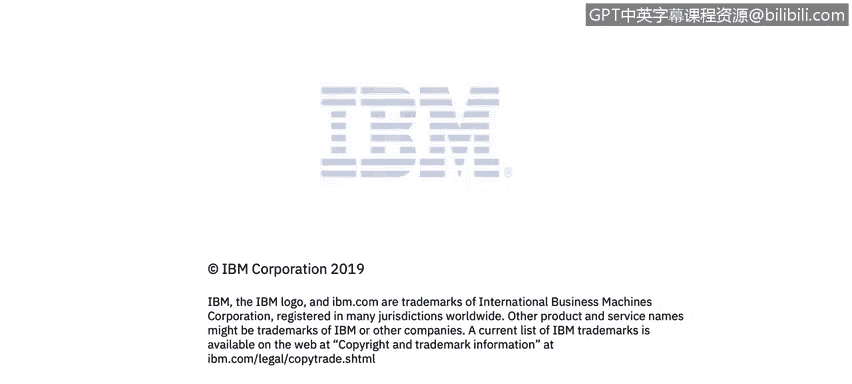

# IBM网络安全分析师专业证书课程2：《网络安全角色、流程与操作系统安全》roles-processes-operating-system-security - P71：32_01_virtualization-module-introduction.en_subtitled - GPT中英字幕课程资源 - BV1G44y1F7oo

In module 7， Warren will discuss the concept of virtualization and how it relates to cybersecurity。

You'll access several Sans Institute resources。 Sands is the most trusted and by far the largest source for information security training and security certification in the world。

SanNs develops， maintains and makes available at no cost the largest collection of research documents on every aspect of information security。

As if that weren't enough， Sands operates the Internets Storm Center。

 which is considered the Internet's early warning system。

Let's find out some more。

