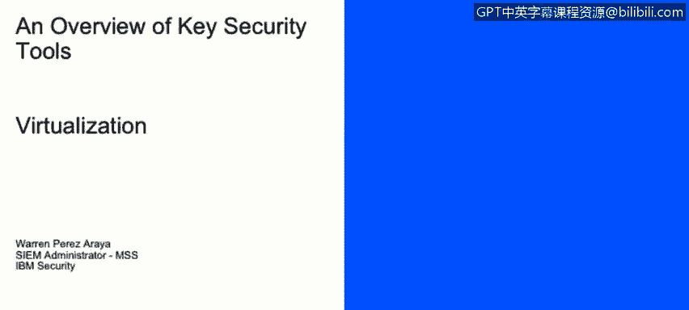
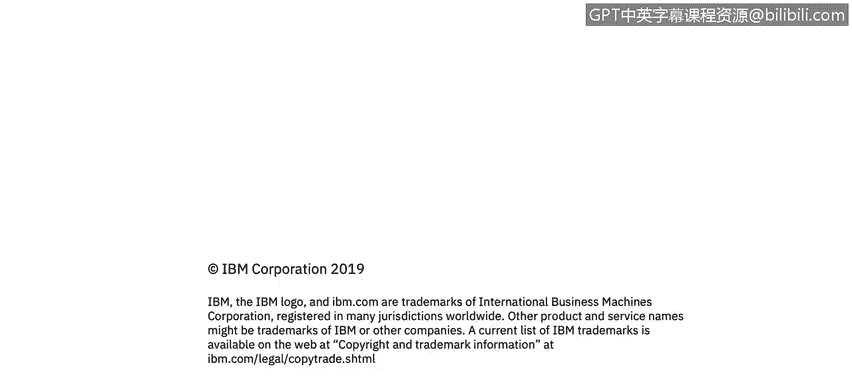

# IBM网络安全分析师专业证书课程2：《网络安全角色、流程与操作系统安全》roles-processes-operating-system-security - P72：33_02_an-overview-of-virtualization.en_subtitled - GPT中英字幕课程资源 - BV1G44y1F7oo

In this video， you will learn to describe the benefits of virtualization and how a virtualized environment differs from a traditional environment。

 Describe the role of the hypervisor in a virtualized environment and describe the role of the virtual machine in a virtualized environment。

 today， we're going to talk about some key concepts of regardingverting virtualization。😊。

Our virtualization allows you to create multiple simulated environments that or dedicated resources from a single physical hardware system。

On the image in your right side of the screen， you could see two infrastructures。

 The one on the left is a traditional infrastructure where you have。Your hardware。

 which is a little purple on the bottom。Buts， and on top of that， you have the operating system。

 and on top of that， you have your applications。On the right side of the image。

 you will see a virtual architecture where you have your。Partartware on the bottom。On top of that。

 you have your virtualization layer， this could be a software。And on top of that， you have。

Your Os and the application for every single virtual machine。 So in this case。

 every single squared that you have Os and app on top， I will represent a virtual machine。

For today's materialization layer， you have the hypervisor also called the host。

Which is the host will be the machine that has the hypervisor installed stop on the hypervissor the software or the application that runs on the actual hardware that allows you to virtualize operating systems。

 and then you have the virtual machines also called the guest machine。

 and it's basically anything that you virtualize on top of the hypervisor or the virtual vision layer。

The happy riseor separates the physical resources from the virtual environment。

 meaning the virtual machines do not have direct access to the hardware itself。

The hyperor sits on top of the operating system。As an end user。

 meaning you could install an application like virtualual B， for sample， or V andware。

Or you could also install it directly on hardware。 This is also called the enterprise mode。

 And a perfect example for this is Meanware Esx， for example。On your right side of your screen。

 you have an image。Where you have your hardware on the bottom。

 you have the and the hypervisor on the middle and you have your reach machines on top of that。

Finally， you have your virtual machines。 It's basically。A single data file。

 It's just like any digital file。 We can be moved from one computer to another。

You can create a virtual machine in one computer， copy that file。

Put it in another hyper with the same type， and then each should run exact losing。

The hyperadvisor relays all the requests from the virtual machines。Onto the hardware itself。

 So virtual machines do not interact directly with the hardware。

 And they have a layer in between because we have discussed。 It's also called harddor。

And the physical hardware is assigned directly to the Vms， but it is done through the hypervisor。

 So you have。Your Ramm， you have your disk， you allocate pieces of that Ram。

 and you allocate that to different machines。 So， for example， we have a total of8 gig Ram。

You could allocate one gig to every single virtual machines that you have。

Are you planning to un on the right side of the screen， You have the same picture。

 But now we're talking about the upper layer， which are the。

Virtual machines that's even top to the hyper compressor。

